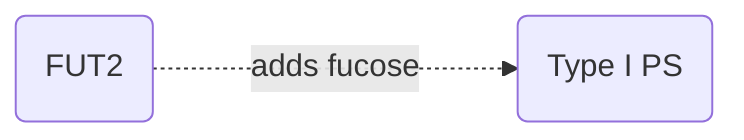
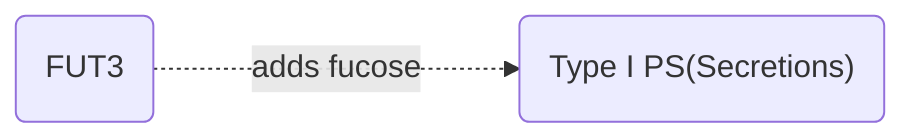
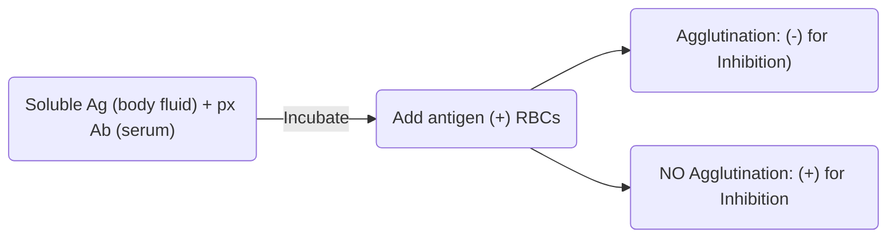

> [!scroller] Table of Contents
> 
> ```table-of-contents
> ```

# BLOOD GROUP SYSTEMS

- There are currently <mark class="red">38 blood group systems</mark> and <mark class="red">1 provisional blood group system</mark>(**CTL-2**: coded in chromosome 19) define a total of <mark class="red">326 unique antigens</mark>
- Each blood group system is **controlled by a single gene** or **by two or more very closely linked HOMOLOGOUS genes** and demonstrates one or more antigens within that system.
- Most blood group antigens are **glycoPROTEINS** and their **specificity is determined either by ==carbohydrate epitopes== or ==amino acid sequences==.**
- ANTIGENS within a blood group system are **POLYMORPHIC**, and these **differences usually arise from a ==single nucleotide polymorphism==** encoding amino acid substitutions in either a glycosyltransferase or extracellular domain of a red cell membrane protein.

## Comparison of Carbohydrate & Protein Blood Group Antigens and Their Antibodies

|                                                                                                                                                                                                                                                                                                                                                                                                                                             |                                                |
| ------------------------------------------------------------------------------------------------------------------------------------------------------------------------------------------------------------------------------------------------------------------------------------------------------------------------------------------------------------------------------------------------------------------------------------------- | ---------------------------------------------- |
| - Examples: <mark class="red">ABO, H, LE, I, P1Pk, GLOB</mark><br><br>Antibodies:<br>  - Often **NATURALLY occurring** (no need to be exposed)<br>  - Usually <mark class="red">IgM</mark><br>  - React **best at ROOM TEMPERATURE**<br>  - Usually cause **direct agglutination with respective antigens**<br>  - Some **may initiate COMPLEMENT ACTIVATION**, noting this on the surface of red cells if AHG reagent contains **anti-C3** | <mark class="red">Carbohydrate</mark> Antigens |
| - Examples: <mark class="red">Fy, Jk, Kel, Rh, MNs</mark><br><br>Antibodies:<br>  - Usually produced as a **result of EXPOSURE TO FOREIGN antigens**<br>  - Usually <mark class="red">IgG</mark><br>  - React **best at 37°C**<br>  - Attach to antigens, **FAILING to demonstrate agglutination**<br>  - <mark class="red">AHG reagent</mark> used to **demonstrate agglutination** when antibody attaches to respective antigen           | <mark class="red">Protein</mark> Antigens      |


## Modes of Inheritance
- Inheritance of blood group genes and the resulting antigens follow the principles of <mark class="red">Independent Segregation</mark> and <mark class="red">Independent Assortment</mark>.
	- only 1 member of the alleleic pair from each parent is passed on to the offspring
- Most blood group AntiGENS are **expressed as AUTOSOMAL DOMINANT or AUTOSOMAL CODOMINANT traits**. Some blood group system genes express their antigens as **autosomal recessive**  traits.

> [!NOTE]
> - AO, BO (autosomal dominant)
> - AB (autosomal codominant)
> - OO (autosomal recessive: have to be HOMOzygous to be expressed)

> [!NOTE] Blood groups inherited via Sex chromosome
> 
> - <mark class="red">XG</mark> (X-linked system; gene coding is located in X chromosome)
> 	- HOMOzygous females (both X chromosomes have gene: X\*X\*): the trait is passed to all offsprings regardless of sex
> 	- HETEROzygous females (only 1 X chromosome is affected: X\*X): 50% of the offsprings will receive the trait
> 	- HEMIZYGOUS males (X\*Y): not passed to male offspring (Y is inherited), only to all female offsprings ^u0aqlm

## ABO and H Blood Group Systems
- The ABO system is the most important blood group system because individuals routinely demonstrate ABO antibodies in their serum to the ABO antigen they lack on their red cells.
- **ABO antibodies occur WITHOUT exposure to RBCs** and LIKELY result from **exposure to <mark class="red">bacteria</mark> with structures similar to A and B antigens.**
- The ABO locus is found on <mark class="red">chromosome 9</mark>, inheritance follow simple <mark class="red">Mendelian genetics</mark> and **ABO phenotype prevalence varies by ETHNICITY**.

- ### ABO Phenotype Prevalence by Ethnicity
| ABO Type | White | Black | Hispanic | Asian            |
| -------- | ----- | ----- | -------- | ---------------- |
| O        | 45%   | 49%   | 56%      | 40%              |
| A        | 40%   | 27%   | 31%      | 28%              |
| B        | 11%   | 20%   | 10%      | 25%              |
| AB       | 4%    | 4%    | 3%       | 7% #table-column |

- The <mark class="red">H, A, and B genes</mark> produce **==GLYCOSYLTRANSFERASE enzymes== that add specific sugars** to preformed structures that **give rise to A, B, and H antigens.**

> [!important]
> ```mermaid
> graph LR
> A(H, A, B genes) -..->|"Glycosyltransferase enyzme"| B
> B("Precursors (Type 1, Type 2 Oligo)") -..-> C
> C(A, B, H antigens)
> 
> ```

|          | <mark class="red">Type 1</mark> Oligosaccharide Chain | <mark class="red">Type 2</mark> Oligosaccharide Chain                                 |
| -------- | ----------------------------------------------------- | ------------------------------------------------------------------------------------- |
| Linkage  | <mark class="red">beta 1-3 </mark>(bet Gal & GlcNAc)  | <mark class="red">beta 1-4</mark> (bet. Gal - GlcNAc)                                 |
| Found in | <mark class="red">Secretions</mark>                   | <mark class="red">RBCs</mark>                                                         |
| Remarks  | <mark class="red">glycoPROTEINS</mark>                | <mark class="red">glycoLIPIDS, glycoPROTEINS, glycoSPHINGOLIPIDS</mark> #table-column |

^ujrbv0

| Gene | Glycosyltransferase                                             | Immunodominant Sugar                           |
| ---- | --------------------------------------------------------------- | ---------------------------------------------- |
| H    | <mark class="red">α 2 L-fucosyltransferase</mark>               | <mark class="red">Fucose</mark>                |
| A    | <mark class="red">α 3 N-acetylagalactosaminyltransferase</mark> | <mark class="red">N-acetylgalactosamine</mark> |
| B    | <mark class="red">α 3 D-galatosyltransferase</mark>             | <mark class="red">D-galactose</mark>           |
| O    | <mark class="red">NONE</mark>                                   | <mark class="red">NONE</mark>                  |

^pdc17t


### Amount of H Antigen on Red Cells

> [!NOTE] (Highest amt. Strongest rx w/ anti-H) <mark class="red">O → A2 → B → A2B → A1 → A1B</mark> (Least amt. Weakest rx w/ anti-H)
> - <mark class="red">O gene</mark> does **NOT PRODUCE a transferase**
> - <mark class="red">A2 gene</mark> has **LESS EFFICIENT transferase** when compared to A1
> - <mark class="red">B genes</mark> and <mark class="red">A and B genes</mark> inherited together **convert H antigen to A and B antigens** with varying degrees of efficiency.

> [!important]
> NO A & B antigens on surface of rbcs if no H antigens

### ABO Subgroups

| Phenotype                      | Red Cell Reactions |        |          |         |        | Serum Reactions |         |
| ------------------------------ | ------------------ | ------ | -------- | ------- | ------ | --------------- | ------- |
|                                | Anti-A             | Anti-B | Anti-A,B | Anti-A1 | Anti-H | A1 cells        | B cells |
| <mark class="red">A1</mark>    | 4+                 | 0      | 4+       | 4+      | 0      | 0               | 4+      |
| <mark class="red">A2</mark>    | 4+                 | 0      | 4+       | 0       | 2+     | 0 / 2+          | 4+      |
| <mark class="red">A3</mark>    | 3+mf               | 0      | 3+mf     | +mf     | 3+     | 0 / 2+          | 4+      |
| <mark class="red">Ax</mark>    | 0 / ±              | 0      | 1-2+     | 0       | 4+     | 0 / 2+          | 4+      |
| <mark class="red">Ael</mark>   | 0                  | 0      | 0        | 0       | 4+     | 0 / 2+          | 4+      |
| <mark class="red">B</mark>     | 0                  | 4+     | 4+       | NT      | 0 / 1+ | 4+              | 0       |
| <mark class="red">B3</mark>    | 0                  | 3+mf   | 3+mf     | NT      | 4+     | 4+              | 0       |
| <mark class="red">Bweak</mark> | 0                  | ± / 2+ | ± / 2+   | NT      | 4+     | 4+              | 0       |
|                                |                    |        |          |         |        |                 |         |

^otr893

> [!NOTE]
> <mark class="red">Bx</mark> (agglutination w/ anti-A,B; wk/0 w/ anti-B; mixed field)

- Two most widely recognized ABO subgroups are A1 and A2, which can be differentiated using <mark class="red">Anti-A1 lectin (Dolichos biflorus)</mark>.
	- <mark class="red">80%</mark>: **A1** individuals
	- <mark class="red">20%</mark>: **A2** individuals
	- <mark class="red">5%</mark>: A2 individuals that will **demonstrate anti-A1** in their serum
	- <mark class="red">35%</mark>: A2B individuals that will **demonstrate anti-A** in their serum
- <mark class="red">Anti-A,B</mark> and<mark class="red"> Anti-H</mark> can also be useful in **differentiating various subgroups of A and B**
- The presence of <mark class="red">weak A and/or weak B antigens</mark> is confirmed by **ADSORBING anti-A or anti-B onto red cells** and subsequently **ELUTING the antibody from those cells.** (attached Abs are removed and ID w/ known A or B cells)
- Studies of **soluble A, B, or H antigens in SALIVA** may also be useful in confirming ABO Type.

> [!NOTE]
> <mark class="red">Adsorption-Elution Technique</mark>: confirmatory to detect presence of weak A/B antigens

### ABO Discrepancies

| Description                                                                                                                                                                                                                                                                                                                                                                                                                                                                                                                                                                   | Type                                      |
| ----------------------------------------------------------------------------------------------------------------------------------------------------------------------------------------------------------------------------------------------------------------------------------------------------------------------------------------------------------------------------------------------------------------------------------------------------------------------------------------------------------------------------------------------------------------------------- | ----------------------------------------- |
| ABO forward typing has **missing, reduced, or unexpected <mark class="red">ANTIGEN</mark>** reactions.<br><br>Possible Causes:<br>- **ABO Subgroup**<br>- **Unusual ABO phenotypes**<br>- **Out-of-group transfusion** or **HPC transplantation**<br>- **Genetic <mark class="red">chimera</mark>**<br>- **Autoagglutination**, **abnormal serum proteins**, **reagent-dependent antibody**, **neutralization** by excess blood group substance<br>- **<mark class="red">POLYAGGLUTINATION</mark>** including T activation and acquired B phenotype<br>- **Technical** errors | <mark class="red">Red Cell </mark>Related |
| ABO reverse typing has **missing, reduced, or unexpected <mark class="red">ANTIBODY</mark>** reactions.<br><br>Possible Causes:<br>- **ABO Subgroup**<br>- **Age** of patient<br>- **<mark class="red">HYPOGAMMAGLOBULINEMIA</mark>**<br>- **Out-of-group transfusion** or **HPC transplantation**<br>- **Cold alloantibody** or **cold autoantibody**<br>- **Rouleaux** from abnormal serum proteins or infusion of **high-molecular-weight volume expanders**<br>- Infusion of **intravenous immunoglobulin**<br>- **Technical** errors                                     | <mark class="red">Serum</mark> Related    |

### ABO Discrepancies and Possible Causes

| Forward | <      | Reverse  | <       | O Cells | Auto | Possible Causes                                                                                                                                                       |
| ------- | ------ | -------- | ------- | ------- | ---- | --------------------------------------------------------------------------------------------------------------------------------------------------------------------- |
| Anti-A  | Anti-B | A1 Cells | B Cells |         |      |                                                                                                                                                                       |
| 0       | 0      | 0        | 0       | 0       | 0    | - **Group O newborn** or **elderly** patient <br> - Patient may have **hypogammaglobulinemia** or **agammaglobulinemia** or may be taking **immunosuppressive drugs** |
| 4+      | 0      | 1+       | 4+      | 0       | 0    | - **Subgroup of A**: Probable **A2 with Anti-A1**                                                                                                                     |
| 4+      | 4+     | 2+       | 2+      | 2+      | 2+   | - **Rouleaux**<br>- **Cold autoantibody** <br> - Cold autoantibody with **underlying cold or RT reacting alloantibody**                                               |
| 1+      | 4+     | 1+       | 0       | 0       | 0    | - **Subgroup of AB**; probable **A2B with anti-1l**                                                                                                                   |
| 4+      | 0      | 0        | 4+      | 3+      | 0    | - **A1 with potent anti-H**                                                                                                                                           |
| 0       | 0      | 4+       | 4+      | 4+      | 0    | - **Oh Bombay**                                                                                                                                                       |
| 0       | 0      | 2+       | 4+      | 0       | 0    | - **Subgroup of A**; probable **Ax with anti-A1**                                                                                                                     |
| 4+      | 2+     | 0        | 4+      | 0       | 0    | - Group **A with an acquired B antigen**                                                                                                                              |
| 4+      | 4+     | 2+       | 0       | 2+      | 0    | - Group **AB with alloantibody**                                                                                                                                      |
| 0       | 4+     | 4+       | 1+      | 1+      | 1+   | - Group **B with cold autoantibody**                                                                                                                                  |

^h3ja29


### Resolution Strategies
- **Antibody identification** studies
- Testing with **lectin reagents**
- Collection of **new blood sample**
- Repeat testing with **washed red cells**
- **Adsorption** and **elution** studies to prove the presence of ABO antigens
- **Autoadsorption of serum** to remove suspected autoantibody followed with repeat testing
- Evaluation of **clinical history**
- Adherence to **standard operating procedures**

### Common Problem-Specific Troubleshooting Procedures

| ABO Discrepancies                                                       | Suggested troubleshooting techniques                                                                                                                                                                                    |
| ----------------------------------------------------------------------- | ----------------------------------------------------------------------------------------------------------------------------------------------------------------------------------------------------------------------- |
| <mark class="red">Absent or weaker</mark> than expected reactions       | 1. <mark class="red">Prolong incubation time</mark> for **15 – 30mins** at **room temperature**<br>2. Incubate at <mark class="red">cold temperatures</mark> (4°C). Watch out for **cold reactivating autoantibodies.** |
| <mark class="red">Acquired B</mark>                                     | 1. Use anti-B with <mark class="red">pH > 8.5 or less than 6.0</mark><br>2. <mark class="red">Reacetylation</mark> using **ACETIC ANHYDRIDE**                                                                           |
| <mark class="red">Cold-reacting alloantibody</mark> to non-ABO antigens | 1. <mark class="red">Ab screen and ID</mark> to identify specificity of the antibody.<br>2. Use **reagent cells that lack the antigen**                                                                                 |
| Rouleaux in <mark class="red">forward</mark> grouping                   | 1. Use <mark class="red">washed RBC</mark> to remove plasma<br>2. <mark class="red">Saline dilution or replacement</mark> technique                                                                                     |
| Rouleaux in <mark class="red">reverse</mark> grouping                   | 1. <mark class="red">Saline dilution or replacement</mark> technique                                                                                                                                                    |

> [!warning] Possible Causes of Acquired B Phenomenon (Pseudo B antigen)
> - E. coli 086
> - Proteus vulgaris
> - Intestinal disorders
> - Colorectal malignancies

### Practice: IDENTIFICATION OF ABO DISCREPANCIES

### Bombay (Oh) Phenotype
- Arises from the inheritance of **NONfunctional <mark class="red">H gene</mark> and a NONfunctional <mark class="red">Se gene</mark>.**
- ~ **UNABLE to produce A and/or B antigens** even though normal A and/or B genes are inherited.
- Red cells **lack all ABH antigens** and **demonstrate potent and clinically significant anti-A, anti-B, anti-A,B and anti-H** in their serum.
- Only blood from other Oh individuals will be suitable for transfusion therapy
- <mark class="red">Parabombay</mark>: **H-deficient** individual with a **functional FUT2 or Se gene.**

#### Differentiation of Bombay vs Group O Individuals

> [!NOTE]
> use anti-H lectin (Ulex europaeus)
> serum reacted w/ O cells

| Phenotype | Anti-A | Anti-B | Anti-H                   | A1 cells | B cells | O cells           |
| --------- | ------ | ------ | ------------------------ | -------- | ------- | ----------------- |
| Group O   | -      | -      | +                        | +        | +       | -                 |
| Bombay    | -      | -      | - <br><br>(No H antigen) | +        | +       | +<br><br>(anti-H) |

^4kruzg

### ABH Antigens in SECRETIONS and PLASMA

> [!NOTE]
> Se gene is NOT part of any blood group system 
> SeSe
> Sese

- **Soluble antigens** can be found in **SECRETIONS (==saliva==, ==tears==, ==plasma==)** as defined by genes at the <mark class="red">Secretor locus</mark> on chromosome <mark class="red">19</mark>.
- Alleles of Secretor locus are <mark class="red">Se (FUT2)</mark> and <mark class="red">se</mark>.
- Inheritance of **at least 1 Se gene** gives rise to <mark class="red">Secretors</mark> (**78 - 80%**)
- Inheritance of **2 se genes** gives rise to <mark class="red">Nonsecretors</mark> (**20 - 22%**)
- The Secretor locus genes **interact with <mark class="red">ABO</mark>, <mark class="red">H</mark> and <mark class="red">Le</mark> blood group systems**
- <mark class="red">Se (FUT2) gene</mark> codes for **α-fucosyltransferase enzyme** that **adds FUCOSE to ==type 1 oligosaccharide chains==** to **form SOLUBLE H antigen in secretions**, thus soluble A and B antigen can then be made if the corresponding gene is inherited.


## Lewis Blood Group System
- Alleles of the Le locus include <mark class="red">Le (FUT3)</mark> and <mark class="red">le</mark>. **Le is ==autosomal DOMINANT==** whereas **le is ==autosomal RECESSIVE==**.
- The product of <mark class="red">Le (FUT3) gene</mark> is an **α-fucosyltransferase** that **adds fucose to ==soluble type 1 oligosaccharide chains==.**
- There are <mark class="red">2 LE antigens </mark> (**Lea, Leb**) and <mark class="red">3 LE phenotypes</mark> (**Le(a-b-), Le(a+b-), Le(a-b+)**)


### Lewis Antigens
- ~  are **NOT SYNTHESIZED by the red cell** but are **PASSIVELY ADSORBED onto the red cell** from soluble antigens present in the plasma.
- The addition of a **==single FUCOSE== gives rise to <mark class="red">Le^a</mark>**, while **<mark class="red">Le^b</mark> is a result of the addition of ==2 FUCOSE molecules==.**

> [!important] Lewis NONSecretor vs Lewis Secretor
> - Lele/LeLe = FUT3
> 	- add fucose to type 1 PS → Lea
> - Lele/LeLe & SeSe or Sese
> 	- FUT2 = add fucose to Type 1 PS → H Ag
> 	- FUT3 = add fucose to H Ag → Leb
> ```mermaid
> graph LR
> A("Lele/LeLe = FUT3") -..-> |"add fucose"| B("Type 1 PS") -..-> |"product"| J(Lea)
> C("Lele/LeLe & SeSe or Sese") -..-> D
> C -..-> F
> D(FUT2) -..-> |"add fucose"| E("Type 1 PS") -..-> |"product"| H("H Ag")
> F(FUT3) -..-> |"add fucose"| H -..-> |"product"| I(Leb)
> ``` 
> ^bpart7
### Lewis Antibodies
- LE antibodies are **NATURALLY occurring** and can be **produced by <mark class="red">Le(a-b-)</mark> individuals.**
- Anti-<mark class="red">Le^a</mark> **may occur as the ONLY antibody**, usually **IgM** and **clinically INsignificant**.
- Anti-<mark class="red">Le^b</mark> is seen as a **less avid** antibody and may be **found with anti-Le^a**.
- <mark class="red">Pregnant women</mark> may **transiently appear as Le(a-b-)** and can **produce LE antibodies.**

### Interaction of ABO, H, Secretor and LE genes

| Genes            | RBC Phenotype          | Antigens in Secretions |
| ---------------- | ---------------------- | ---------------------- |
| Le, Se, ABH      | A, B, H<br>Le(a-b+)    | A, B, H<br>Lea, Leb    |
| lele, Se, ABH    | A, B, H<br>Le(a-b-)    | A, B, H                |
| Le, sese, ABH    | A, B, H<br>Le(a+b-)    | Lea                    |
| lele, sese, ABH  | A, B, H<br>Le(a-b-)    | None                   |
| Le, sese, hh, AB | Oh<br>Le(a+b-)         | Lea                    |
| Le, Se, hh, AB   | Parabombay<br>Le(a-b+) | A, B, H<br>Lea, Leb    |

^kgzlv8

## Rh Blood Group System
- **Most important system AFTER ABO** because of the **HIGHLY IMMUNOGENIC properties of the D antigen**
- Rh blood group system currently has <mark class="red">55 different antigens</mark> (MOST COMPLEX → MNSs (49) → Kell (36))

### Implications in Transfusion
- Every blood donor and recipient must be ROUTINELY typed for presence or absence of D antigen.
- <mark class="red">Initial D-negative DONORS</mark> will be tested for weak D and must be weak D-negative for the unit to be labelled as Rh-negative.
- <mark class="red">Initial D-negative RECIPIENTS</mark> DO NOT REQUIRE weak D testing.
- ~ In general, give D-positive recipients D-positive blood and D-negative recipients D-negative blood


> [!NOTE] Title
> - The rationale behind this distinction lies in the fact that the presence of weak D in donors can potentially lead to sensitization of Rh-negative recipients, triggering an immune response upon subsequent exposure to Rh-positive blood. However, the reverse scenario, where a recipient has weak D expression, does not pose a significant risk during transfusion. 
> - ~ If ever Weak D pos donor = cause sensitization to recipient = recipient develops Anti-D!!!

### Molecular Basis of the Rh Blood Group System
- **Two closely linked genes** on chromosome <mark class="red">1</mark> control the expression of the **5 most commonly tested Rh antigens, <mark class="red">D, C, E, c and e</mark>.**
- <mark class="red">RHD gene</mark> codes for the presence of **RhD protein** and **D antigen** while <mark class="red">RHCE gene</mark> codes for the presence of **C, E, c and e**.
- <mark class="red">D positive</mark> individuals: inherit **1 or 2 RHD genes** and **2 RHCE genes**
- <mark class="red">D negative</mark> individuals: **complete deletion of RHD genes** and inherit **only 2 RHCE genes**
- <mark class="red">RHCE</mark> has several alternate alleles to explain the 4 combinations of the C/c and E/e antigens.
### Rh genes and 8 Common Haplotypes

| 1st locus | 2nd locus | Fisher-Race Haplotype | Wiener Haplotype | Antigens |
| --------- | --------- | --------------------- | ---------------- | -------- |
| RHD       | RHCE\*Ce  | DCe                   | R1               | D, C, e  |
| RHD       | RHCE\*cE  | DcE                   | R2               | D, c, E  |
| RHD       | RHCE\*CE  | DCE                   | Rz               | D, C, E  |
| RHD       | RHCE\*ce  | Dce                   | R0               | D, c, e  |
| -         | RHCE\*Ce  | Ce                    | r'               | C, e     |
| -         | RHCE\*cE  | cE                    | r''              | c, E     |
| -         | RHCE\*CE  | CE                    | ry               | C, E     |
| -         | RHCE\*ce  | ce                    | r                | c, e     |

^3ws7kv

### Rh Most Probable Genotypes

|                                                 |                                                                                                          |
| ----------------------------------------------- | -------------------------------------------------------------------------------------------------------- |
| <mark class="red">Haplotype</mark>              | Inherited **allele from each parent** expressed in a single term that **denotes the common Rh antigens** |
| <mark class="red">Genotype</mark>               | Inherited **haplotypes** or inherited **genes**                                                          |
| <mark class="red">Phenotype</mark>              | Derived from **cell typing results**                                                                     |
| <mark class="red">Most Probable Genotype</mark> | Determined from **typing results**, **haplotype/genotype frequencies**, and **family studies**           |

### Racial/Ethnic Prevalence of Rh Haplotypes

|             | Fisher-Race | Wiener | <mark class="red">White (%)</mark> | <mark class="red">Black (%)</mark> | <mark class="red">Asian (%)</mark> |
| ----------- | ----------- | ------ | ---------------------------------- | ---------------------------------- | ---------------------------------- |
| Rh-positive | DCe         | R1     | 42                                 | 17                                 | 70                                 |
|             | DcE         | R2     | 14                                 | 11                                 | 21                                 |
|             | Dce         | R0     | 4                                  | 44                                 | 3                                  |
|             | DCE         | Rz     | <0.01                              | <0.01                              | 1                                  |
| Rh-negative | ce          | r      | 37                                 | 26                                 | 3                                  |
|             | Ce          | r’     | 2                                  | 2                                  | 2                                  |
|             | cE          | r”     | 1                                  | <0.01                              | <0.01                              |
|             | CE          | Ry     | <0.01                              | <0.01                              | <0.01                              |

^q6xzcb

### Practice: ID of MPG

| Anti-D | Anti-C | Anti-E | Anti-c | Anti-e |
| ------ | ------ | ------ | ------ | ------ |
| +      | +      | 0      | 0      | +      |

- Antigens present: D, C, e
- Possible genotypes: RHD RHCE\*Ce/RHD RHCE\*Ce or RHD RHCE\*Ce/RHCE\*Ce
- Most probable genotype: R1/R1 or R1/r', based on table, MPG is R1/R1

### Rh Antibodies
- Immune-type, result of exposure to antigens genetically absent in the antibody producer.
- Usually <mark class="red">IgG1</mark> or <mark class="red">IgG3</mark> but DO NOT ACTIVATE complement.
- Usually **react at the <mark class="red">AHG phase</mark> of testing.**
- Clinically SIGNIFICANT, capable of causing <mark class="red">HDFN</mark> and <mark class="red">acute and delayed transfusion reactions.</mark>
- Anti-D had been the **MOST FREQUENT cause of HDFN** PRIOR to the advent of RhIG.

> [!NOTE]
> TODAY, most common cause of HDFN is <mark class="red">ABO incompatibility</mark>

### Rh Typing Reagents

|                                                                                                                                                                                                                                                                                                                                                                                                                                               |                                               |
| --------------------------------------------------------------------------------------------------------------------------------------------------------------------------------------------------------------------------------------------------------------------------------------------------------------------------------------------------------------------------------------------------------------------------------------------- | --------------------------------------------- |
| - Routine **MONOCLONAL reagents** used most frequently<br>- Anti-D may be **from several clones** to enhance **reactivity with multiple D epitopes**<br>- Usually <mark class="red">IgM</mark> and <mark class="red">IgG</mark> are blended to **enable weak D testing** at the <mark class="red">AHG</mark> phase<br>- <mark class="red">ABO typing</mark> serves as the NEGATIVE control                                                    | <mark class="red">Low</mark> Protein Reagent  |
| - **POLYSPECIFIC reagent** containing <mark class="red">IgG</mark> anti-D obtained**from immunized persons**<br>- Contains approximately **20% to 24% protein** and other **high-molecular weight additives**, enabling reaction at <mark class="red">IS</mark> and can be used at <mark class="red">AHG</mark> phase<br>- Requires the use of **Rh control from the SAME manufacturer** (Rh control should be NEGATIVE for test to be valid) | <mark class="red">High</mark> Protein Reagent |


### Rh Typing
- <mark class="red">85% to 92% of red cells</mark> will react at IS with anti-D and are identified as **D-POSitive**
- <mark class="red">8% to 15% of red cells</mark> will FAIL TO REACT at IS and are identified as **D-NEGative** (require Weak D testing)
- Weak D testing may be performed on red cells that are identified as D-negative
	- Requires incubation of red cells with **anti-D at 37°C** and the addition of **AHG** 
	- An <mark class="red">appropriate control</mark>, **NEGATIVE at the AHG phase** of testing is necessary for proper interpretation

### Causes of Discrepancy in Rh Testing

|                                                                                                                                                                                                                                                                                                                                           |                                                 |
| ----------------------------------------------------------------------------------------------------------------------------------------------------------------------------------------------------------------------------------------------------------------------------------------------------------------------------------------- | ----------------------------------------------- |
| - Positive DAT (depends on Rh reagent used)<br>- NONREACTIVE reagent with a **variant or weak form of the antigen**<br>- **Too heavy cell suspension**<br>- Failure to add or added the wrong reagent<br>- Centrifugation too short or rpm too low<br>- **Deterioration** of reagents or contamination<br>- **Vigorous shaking** of tubes | False-<mark class="red">negative</mark> Rh Test |
| - Positive DAT (depends on Rh reagent used) - less common due to LOW protein reagents used<br>- <mark class="red">Rouleaux</mark> or <mark class="red">fibrin</mark><br>- **Wrong/contaminated reagent**<br>- **Overcentrifugation**<br>- <mark class="red">Polyagglutination</mark>                                                      | False-<mark class="red">positive</mark> Rh Test |


### Weak D Classification

|                                                                                                                                                                                                                                                                                                                                                                           |                                                              |
| ------------------------------------------------------------------------------------------------------------------------------------------------------------------------------------------------------------------------------------------------------------------------------------------------------------------------------------------------------------------------- | ------------------------------------------------------------ |
| - **ALL pieces of the D protein** are PRESENT, but in REDUCED quantities.<br>- Persons of this type do NOT MAKE anti-D <br>- Increased use of **molecular testing** to determine need of RhIG in this genetic population<br><br>(Type <mark class="red">1, 2, 3, 4.1</mark>): do not produce anti-D<br>(Type <mark class="red">4.0</mark>): may produce anti-D; need RhIg | <mark class="red">Weak</mark> D<br><br>QUANtitative defect   |
| - Inheritance of unique RHD genes that produce some, but **NOT ALL epitopes of the D protein**<br>- Can make **antibodies to portions of D antigen** they lack<br>- Give <mark class="red">D-NEGative blood</mark>; should receive RhIG                                                                                                                                   | <mark class="red">Partial</mark> D<br><br>QUALitative defect |


### Other Rh Antigens and Unusual Phenotypes


|                                                                                                                                                                                                                                                                                                                                                                                                                                                                                                                                                                                                                                                                                                                                                                          |                                                |
| ------------------------------------------------------------------------------------------------------------------------------------------------------------------------------------------------------------------------------------------------------------------------------------------------------------------------------------------------------------------------------------------------------------------------------------------------------------------------------------------------------------------------------------------------------------------------------------------------------------------------------------------------------------------------------------------------------------------------------------------------------------------------ | ---------------------------------------------- |
| Define epitopes that **depend on CONFORMATIONAL CHANGES** resulting from **amino acids associated with <mark class="red">C, E, c and e antigens</mark>**<br><br>![[BB (ASCPi)#^w77dyz]]                                                                                                                                                                                                                                                                                                                                                                                                                                                                                                                                                                                  | <mark class="red">Compound</mark> Antigens     |
| - Found on **red cells that express the<mark class="red"> D and/or C antigen</mark>**<br>- Antibodies to G appear as <mark class="red">anti-D plus anti-C</mark> but **CANNOT be separated**<br>                                                                                                                                                                                                                                                                                                                                                                                                                                                                                                                                                                         | <mark class="red">G</mark> Antigen             |
| - Rh phenotypes which suggest that **pieces of genetic material that make CEce antigens have been DELETED** (w/ ENHANCED expression of the D antigen)<br>- Phenotypes include: <mark class="red">D--, D.., Dc-, DCw-</mark>                                                                                                                                                                                                                                                                                                                                                                                                                                                                                                                                              | <mark class="red">D Deletion </mark>Phenotypes |
| - FAILS to demonstrate the presence of any Rh antigens<br><br>2 distinct genetic backgrounds<br><mark class="red">Regulator type</mark> (more common)<br>- **==HAG gene== is ABSENT or MUTATED**<br>- RHD and RHCE genes that are present **can’t produce their respective antigens**<br><mark class="red">Amorph type</mark><br>- Arises from **mutations to the ==RHCE genes==** in both parents and **deletion of ==RHD genes==**<br><br>- Rhnull red cells express **DECREASE levels of <mark class="red">glycophrin B</mark>** and **lack <mark class="red">Fy5</mark> and <mark class="red">LW antigens</mark>** (LWa, LWb)<br>- **Persons who are Rhnull** experience a form of <mark class="red">hemolytic anemia</mark> (due to: **Hereditary Stomatocytosis**) | <mark class="red">Rhnull</mark> Phenotype      |


#### Compound Antigens

| Gene producing antigen | Antigen    |
| ---------------------- | ---------- |
| RHCE*ce                | ce or f    |
| RHCE*Ce                | Ce or rhi  |
| RHCE*cE                | cE or Rh27 |
| RHCE*CE                | CE or RH22 |

^w77dyz


## P1PK & GLOB Blood Group Systems
- P1PK blood group system has **3 antigens**, <mark class="red">P1, Pk and NOR</mark>
- GLOB blood group system has **2 antigens**, <mark class="red">P</mark> and <mark class="red">PX2</mark>
- ~ <mark class="red">P1, P and Pk</mark> are the **most relevant** to the blood bank and give rise to <mark class="red">5 phenotypes</mark>.

| Phenotype                    | Antigens on RBCs | Antibodies in Serum          |
| ---------------------------- | ---------------- | ---------------------------- |
| <mark class="red">P1</mark>  | P1, P, Pk        | None                         |
| <mark class="red">P2</mark>  | P, Pk            | anti-P1                      |
| <mark class="red">p</mark>   | None             | anti-PP1Pk                   |
| <mark class="red">P1k</mark> | P1, Pk           | anti-P and Anti-PX2          |
| <mark class="red">P2k</mark> | Pk               | anti-P, anti-P1 and anti-PX2 |

^4hh1rt


- <mark class="red">Four</mark> of the 5 phenotypes produce **antibodies with the following specificities**.

|                                                                                                                                                                                                                                                                                                                                                                                                                                                      |                                     |
| ---------------------------------------------------------------------------------------------------------------------------------------------------------------------------------------------------------------------------------------------------------------------------------------------------------------------------------------------------------------------------------------------------------------------------------------------------- | ----------------------------------- |
| - Naturally occurring and clinically INsignificant<br>- Reactivity with P1 + red cells may be VARIABLE<br>- Reactivity can be **INHIBITED by <mark class="red">hydatid cyst fluid</mark> or <mark class="red">Pl substance</mark> derived from pigeon eggs**                                                                                                                                                                                         | <mark class="red">Anti-P1</mark>    |
| - Naturally occurring in <mark class="red">p individuals</mark>; IgM or IgM and IgG and clinically SIGNIFICANT <br>- Separable mixture of **anti-P**, **anti-P1** and **anti-Pk**<br>- Associated with <mark class="red">recurrent spontaneous abortions</mark>                                                                                                                                                                                      | <mark class="red">Anti-PP1Pk</mark> |
| - Naturally occurring in <mark class="red">P1k and P2k individuals</mark><br>- IgM or IgM and IgG and clinically SIGNIFICANT<br>- Associated with <mark class="red">recurrent spontaneous abortions</mark><br>- Frequently the **autoantibody specificity in <mark class="red">PCH</mark>**<br><br>- <mark class="red">Donath-Landsteiner Ab</mark> (IgG biphasic: binds RBC @ cold T, hemolysis @ 37C)<br>- system that **deteriorates on storage** | <mark class="red">Anti-P</mark>     |

^tf674k


## I Blood Group System and Ii Blood Group Collection
- I, is the ONLY antigen of the I blood group system
- i, is the ONLY antigen of the Ii blood group collection
- **Adult red cells** are generally <mark class="red">I-positive</mark>, while **cord blood red cells** are <mark class="red">i-positive</mark>

### I System and Ii Collection Antibodies


|                                                                                                                                                                                                                                                                                                                           |                                  |
| ------------------------------------------------------------------------------------------------------------------------------------------------------------------------------------------------------------------------------------------------------------------------------------------------------------------------- | -------------------------------- |
| - Harmless and common IgM autoantibody<br>- May be pathologic and the causative antibody in <mark class="red">CAD</mark><br>- May be seen in association with <mark class="red">Mycoplasma pneumoniae</mark> infections                                                                                                   | <mark class="red">Anti-I</mark>  |
| - Harmless and common IgM autoantibody<br>- Reacts preferentially **with adult I-positive cells** that express the greatest amount of H antigen (**O cells**); Usually detected in <mark class="red">serum of A1 individuals</mark><br>- May be pathologic and the causative autoantibody in <mark class="red">CAD</mark> | <mark class="red">Anti-IH</mark> |
| - LESS COMMON IgM autoantibody<br>- Reacts preferentially with <mark class="red">adult red cells</mark> and <mark class="red">cord blood red cells</mark><br>- May be pathologic and the causative autoantibody in <mark class="red">CAD secondary to IM</mark>                                                           | <mark class="red">Anti-i</mark>  |


## MNS Blood Group System (49 antigens)
- **Two genes** that are responsible for this blood group system are located on chromosome <mark class="red">4</mark>
- ~ <mark class="red">GYPA</mark>: produces **glycophorin A (GPA)**, which carries the <mark class="red">M and N antigens</mark>
- ~ <mark class="red">GYPB</mark>: produces **glycophorin B (GPB)**, which carries the <mark class="red">S and s antigens</mark>

### MNS Antigens

|                                                                                                                                    |                            |
| ---------------------------------------------------------------------------------------------------------------------------------- | -------------------------- |
| Demonstrates <mark class="red">serine</mark> and <mark class="red">glycine</mark> on the 1st and 5th positions respectively        | <mark class="red">M</mark> |
| Demonstrates <mark class="red">leucine</mark> and <mark class="red">glutamic acid</mark> on the 1st and 5th positions respectively | <mark class="red">N</mark> |
| Demonstrates <mark class="red">methionine</mark> at the 29th position                                                              | <mark class="red">S</mark> |
| Demonstrates <mark class="red">threonine</mark> at the 29th position                                                               | <mark class="red">s</mark> |

### Rare Phenotypes

|                                                                                                             |                                   |
| ----------------------------------------------------------------------------------------------------------- | --------------------------------- |
| Lacking **all or part of GPA** due to exon deletion, thus lacking <mark class="red">M and N antigens</mark> | <mark class="red">En^a</mark>     |
| Lacking <mark class="red">S, s and U antigens </mark>due to **GYPB deletion**                               | <mark class="red">S- s- U-</mark> |
| Lacking all <mark class="red">MNS system</mark> antigens due to **Mk gene**                                 | <mark class="red">M^k M^k</mark>  |


### MNS Antibodies

|                                                                                                                                                                                                                                         |                                    |
| --------------------------------------------------------------------------------------------------------------------------------------------------------------------------------------------------------------------------------------- | ---------------------------------- |
| - Naturally occurring, <mark class="red">IgM</mark> and clinically INsignificant<br>- Reacts more strongly with cells expressing a **double dose of the antigen**<br>- **Enhanced** at pH of approximately <mark class="red">6.5</mark> | <mark class="red">Anti-M</mark>    |
| Naturally occurring, <mark class="red">IgM</mark> and clinically INsignificant                                                                                                                                                          | <mark class="red">Anti-N</mark>    |
| Immune-type, <mark class="red">IgG</mark>, clinically SIGNIFICANT                                                                                                                                                                       | <mark class="red">Anti-S, s</mark> |


## Kell Blood Group System
- Consists of <mark class="red">36 unique antigens</mark>, 6 of which are of interest
	- LOW-prevalence antigens: <mark class="red">Jsa, Kpa, K</mark>
	- HIGH-prevalence antigens: <mark class="red">Jsb, Kpb, k</mark>
- ~ Within certain races, these low prevalence antigens occur more frequently

### KEL System Phenotype Prevalence by Ethnicity

| Phenotype  | White (%) | Black (%) |
| ---------- | --------- | --------- |
| K- k+      | 91        | 98        |
| K+ k-      | 8.8       | 2.0       |
| K+ k+      | 0.2       | Rare      |
| Kp (a- b+) | 97.7      | 100       |
| Kp (a+ b-) | Rare      | 0.0       |
| Js (a- b+) | 100       | 80        |
| Js (a+ b-) | Rare      | 19        |
| Js (a+ b-) | 0.0       | 1.0       |

^zorjtk

> [!NOTE]
> Jsa (20% blacks)
> Kpa (over 2% of the whites
> K (9% whites, 2%???)

- When an individual inherits <mark class="red">2 KEL genes</mark> that both produce the **same low-prevalence** antigen, the **anti-thetical high prevalence antigen is ABSENT** from their red cells.

|                                                                                                                                                                                                                                                                                                                                                                                        |                                 |
| -------------------------------------------------------------------------------------------------------------------------------------------------------------------------------------------------------------------------------------------------------------------------------------------------------------------------------------------------------------------------------------- | ------------------------------- |
| - **Lack <mark class="red">ALL KEL</mark> system antigens**<br>- **Immunized individuals produce <mark class="red">anti-Ku</mark>**, requiring transfusion with **Ko red cells**                                                                                                                                                                                                       | <mark class="red">Ko</mark>     |
| - Express **DIMINISHED amount of KEL antigens** and **lack the high-prevalence antigens, <mark class="red">Kx and Km</mark>.**<br>- Associated with <mark class="red">acanthocytosis</mark>, <mark class="red">CGD</mark> and <mark class="red">neurologic</mark> and <mark class="red">muscular</mark> symptoms<br>- Immunized individuals may produce **anti-Kx** and/or **anti-Km** | <mark class="red">McLeod</mark> |


### Kell System Antibodies

- Usually IgG and clinically SIGNIFICANT
- Must provide **antigen-NEGATIVE blood for transfusion**

|                                                             |                                   |
| ----------------------------------------------------------- | --------------------------------- |
| Produced by <mark class="red">K+k-</mark> individuals       | <mark class="red">anti-k</mark>   |
| **Common alloantibody**                                     | <mark class="red">anti-K</mark>   |
| Produced by <mark class="red">Kp (a+ b-)</mark> individuals | <mark class="red">anti-Kpb</mark> |
| Produced by <mark class="red">Js (a+ b-)</mark> individuals | <mark class="red">anti-Jsb</mark> |


## Duffy Blood Group System
- The gene responsible for the FY antigens is <mark class="red">ACKR1</mark>, located on chromosome <mark class="red">1</mark>
- There are <mark class="red">5 FY system antigens</mark>
	- <mark class="red">Fya, Fyb, Fy6</mark>: DESTROYED by proteolytic enzymes
	- <mark class="red">Fy3, Fy5</mark>: RESISTANT to proteolytic enzymes
- The 4 common FY system phenotypes vary by ethnicity

### FY System Phenotype Prevalence by Ethnicity

| Phenotype  | White (%) | Black (%) |
| ---------- | --------- | --------- |
| Fy (a+ b-) | 20        | 10        |
| Fy (a+ b+) | 48        | 3         |
| Fy (a- b+) | 32        | 20        |
| Fy (a- b-) | 0         | 67        |

^9h80n4

> [!NOTE]
> Fy(a-b-): resistance against malaria; produce anti-Fy3
> NO Fy6 (receptor for plasmodium; no way to infect)

- FY system antibodies are <mark class="red">IMMUNE</mark> in origin, **IgG** and **clinically SIGNIFICANT**. <mark class="red">Anti-Fya</mark> is seen **more frequently** than anti-Fyb.

## Kidd Blood Group System
- The gene responsible for the JK antigens is <mark class="red">SLC14A1</mark> located on chromosome <mark class="red">18</mark>
- There are 3 JK antigens, <mark class="red">Jka</mark>, <mark class="red">Jkb</mark> and <mark class="red">Jk3</mark>
	- <mark class="red">Jka, Jkb</mark>: **RESISTANT to proteolytic enzymes** and are **POOR immunogens**
- Kidd system antibodies are **IgG**, clinically SIGNIFICANT antibodies capable of <mark class="red">complement activation</mark>
	- Reactivity is **ENHANCED if red cells are treated with PROTEOLYTIC ENZYMES**
	- Preferentially react with red cells expressing a **DOUBLE DOSE of the antigen**
	- Antibody levels **decline overtime** and may go undetected
	- May activate <mark class="red">more C3</mark> than IgG molecules, but may go undetected based on the type of AHG reagent used.

> [!NOTE]
> Notorious in causing delayed transfusion reaction
> Jk (a-b-) = Polynesians, Chinese; also lack Jk3 (produce anti-Jk3)

## Lutheran Blood Group System
- The gene responsible for the LU antigens is <mark class="red">BCAM</mark>, located on chromosome <mark class="red">19</mark>
- There are <mark class="red">25</mark> LU system antigens, but the most familiar include:
	- <mark class="red">Lua</mark>: **LOW-prevalence**
	- <mark class="red">Lub</mark>: **HIGH-prevalence**
- Antibodies in the LU system are most often IgG, IMMUNE in origin and have been associated with <mark class="red">delayed HTRs</mark> and <mark class="red">mild HDFN</mark>.
	- <mark class="red">anti-Lua</mark>: may be **naturally occurring** and can be **IgM**, **IgG** or **IgA**
	- <mark class="red">anti-Lub</mark>: formed in individuals who are <mark class="red">Lu(a+ b-)</mark>
	- <mark class="red">anti-Lu3</mark>: produced by <mark class="red">Lu(a- b-)</mark> individuals, **reactive with all RBCs except other Lu (a- b-) RBCs**

## Landsteiner-Wiener Blood Group System
- The gene responsible for the LW antigens is <mark class="red">ICAM4</mark>, located on chromosome <mark class="red">19</mark>
- There are <mark class="red">3</mark> LW system antigens including:
	- <mark class="red">LWb</mark>: **LOW-prevalence**
	- <mark class="red">LWa, LWab</mark>: **HIGH-prevalence**
- <mark class="red">LW-null</mark> phenotype, **lacks the LWab antigen** (LW (a-b-))
- <mark class="red">D-positive</mark> red cells **express more LW antigen** than D-negative red cells

##

|                                                                                                                                                                                                                                                                                                               |                                                      |
| ------------------------------------------------------------------------------------------------------------------------------------------------------------------------------------------------------------------------------------------------------------------------------------------------------------- | ---------------------------------------------------- |
| - Antigens that occur in **<1% of the population**<br>- Usually **NOT DIFFICULT to find compatible blood**<br>- AntiBODIES to these antigens are hard to test for<br>- Suspected if an **AHG crossmatch is INCOMPATIBLE** and other causes have been ruled out, such as a positive DAT or ABO incompatibility | Antigens of <mark class="red">LOW</mark> Prevalence  |
| - Antigens that occur in **greater than 98%** of the population<br>- Difficult to find antigen-negative compatible blood<br>- **AntiBODIES to these antigens are typically clinically SIGNIFICANT**<br>- Antibodies are rare and difficult to identify due to **lack of NEGATIVE panel cells**                | Antigens of <mark class="red">HIGH</mark> Prevalence |

### CALCULATIONS OF FINDING COMPATIBLE BLOOD
- Finding compatible blood is based on the **incidence of being antigen-NEGATIVE**

![[Pasted image 20240507144745.png]]
### Practice: FINDING COMPATIBLE BLOOD

- Sample Problem 1
	- Anti-K and anti-c were found in a patient with colon cancer. How many units of red cells would need to be screened to find two compatible units for surgery? The antigen negative frequency for K and c are 0.91 and 0.20, respectively.
- Sample Problem 2
	- A patient with anti-K and anti-Jka in her plasma needs 2 units of RBC for surgery. How many group specific units would need to be screened to find 2 units of RBC. The frequency of Jk (a+) is 77% and K+ is 10%.

## Other Genetic Systems in Blood Banking

### The HLA System
- Important in **transplantation** and in <mark class="red">TA-GVHD</mark>
- Important in <mark class="red">platelet refractoriness</mark>; patient **FAIL to achieve a therapeutic increment in platelet count after platelet transfusion**
	- **HLA-matched donors** or **family members** as a source of platelets can be beneficial
	- **Platelet crossmatching of patient serum** with donor platelets may also be useful
> [!NOTE]
> coded in chromosome <mark class="red">6</mark>
> platelets NO NEED to be ABO compatible, unless HIGH RBC contamination
> most of the alloantibodies are directed against HLA class I antigens
> CASE: platelet did not achieve plt increment after transfusion of platlet unit. A: px developed anti-HLA antibodies against platelets 

### Human Platelet Antigens

> [!NOTE]
> <mark class="red">35</mark> identified HPA

- <mark class="red">HPA-1a</mark> is the **most familiar platelet antigen**
- **\>80% of HPA-specific antibodies** detected are <mark class="red">anti-HPA-1a</mark>
- Clinical conditions related to HPA antibodies include:
	- <mark class="red">Fetal and neonatal alloimmune thrombocytopenia</mark>: maternal IgG HPA antibodies cross the placenta and **destroy fetal platelets**
	- <mark class="red">Posttransfusion purpura</mark>: occurs **5-10 days after a red cell transfusion**; produces profound **thrombocytoPENIA** and **destruction of patient’s own red cells**
	- <mark class="red">Platelet transfusion refractoriness</mark>

### Human Neutrophil Antigens
- <mark class="red">Nine</mark> HNAs have been described
- Clinical conditions related to HNA antibodies include:
	- <mark class="red">Neonatal alloimmune neutropenia</mark>: maternal IgG HNA antibodies cross the placenta causing **neonatal neutroPENIA**
	- <mark class="red">Transfusion-related acute lung injury</mark>: characterized by respiratory distress, hypo and hypertension, noncardiogenic pulmonary edema that can be life-threatening; usually occurs **within 6 hours** after receiving a blood component.
		- also associated with **HNA, HLA**
		- px are given <mark class="red">Leukoreduced RBCs</mark> for prevention

# BLOOD GROUP IMMUNOLOGY

> [!important]
> BGS w/ <mark class="red">carbohydrate</mark> antigens (usually Abs: **IgM** nature)
> BGS w/ <mark class="red">protein</mark> antigens (usually Abs: **IgG** nature)

|                                                                                                                                                                                                                                                                                       |                                                         |
| ------------------------------------------------------------------------------------------------------------------------------------------------------------------------------------------------------------------------------------------------------------------------------------- | ------------------------------------------------------- |
| - Occur **naturally** or produced from exposure to substances in the environment with structures similar to RBC antigens<br>- Examples: <mark class="red">ABO, LE, I, P1PK, GLOB, M+N</mark><br><br>usually **react BEST AT ROOM T**<br>detected at <mark class="red">IS phase</mark> | <mark class="red">Naturally-Occurring </mark>Antibodies |
| - Produced as a **result of RBC antigen exposure** from transfusion, pregnancy, or transplantation<br>- Examples: <mark class="red">Rh, KEL, Jk, Fy, SsU</mark><br><br>**clinically SIGNIFICANT**<br>usually react most of the time at <mark class="red">AHG/IAT phase</mark>         | <mark class="red">Immune-Type</mark> Antibodies         |

|                                                                                                                                                                                                                                                                                                                                     |                                                    |
| ----------------------------------------------------------------------------------------------------------------------------------------------------------------------------------------------------------------------------------------------------------------------------------------------------------------------------------- | -------------------------------------------------- |
| - Occurs **DAYS to MONTHS** after a transfusion event<br>- Initial antibody produced is <mark class="red">IgM</mark>, followed by IgG<br>- IgM eventually disappears, but **IgG persists INDEFINITELY**                                                                                                                             | <mark class="red">Primary</mark> Immune Response   |
| - Occurs in **HOURS to DAYS** after a transfusion event<br>- **Large quantities of <mark class="red">IgG</mark> antibody** are produced<br>- Often associated with <mark class="red">delayed hemolytic</mark> and <mark class="red">serologic transfusion reactions</mark><br><br>aka: <mark class="red">Anamnestic response</mark> | <mark class="red">Secondary</mark> Immune Response |

## Antigen-Antibody Interactions in Blood Banking

|                                                                                                                                                                                                                                                                                                         |                                                        |
| ------------------------------------------------------------------------------------------------------------------------------------------------------------------------------------------------------------------------------------------------------------------------------------------------------- | ------------------------------------------------------ |
| - Binding of antibodies to antigens on red cell membrane<br>- Utilizes **hydrogen bonds**, **van der Waals interactions**, and **electrostatic charges**<br><br>NonCovalent interactions, REVERSIBLE                                                                                                    | <mark class="red">1st (Sensitization)</mark> Phase     |
| - Formation of an agglutination lattice by **antibody-sensitized red cells**<br>- Antibody molecules must be able to **span the distance between adjacent red cells** to form this lattice<br><br>lattice formation (depends on the Ab class: IgM (direct agglutination); IgG (indirect agglutination)) | <mark class="red">2nd (Lattice formation)</mark> Phase |

> [!NOTE]
> Other than agglutination, <mark class="red">HEMOLYSIS</mark> can also signify the presence of antigen-antibody interaction

### Factors Affecting Agglutination
1. **Centrifugation** brings reactants closer together
2. **Antigen-antibody concentrations**
3. **pH**, some antibodies react with antigens more strongly at lower pH (eg. **anti-M (>6.5)**)
4. **Temperature** and **immunoglobulin** class (**IgM = RS, RT**; **IgG = IAT, 37C**)
5. Increase **incubation** times
6. **Enhancement media**
	- <mark class="red">22% albumin</mark>: increases dielectric constant, reducing zeta potential
	- <mark class="red">LISS</mark>: reduces zeta potential
	- <mark class="red">PEG</mark>: increases dielectric constant, excludes water, reduces zeta potential
	- <mark class="red">Proteolytic enzymes</mark>: used to modify red cells, may enhance or negate the ability of antibodies to agglutinate red cells. (eg. <mark class="red">Ficin, Papain</mark>)

|                                 |                                                      |
| ------------------------------- | ---------------------------------------------------- |
| ENHANCED after enzyme treatment | <mark class="red">Rh, P1Pk, I, Jk, LE</mark>         |
| NEGATED after enzyme treatment  | <mark class="red">M, N, Fya, Fyb, Ch, Rg, Xga</mark> |


## Antiglobulin Tests (Coomb's technique)

### Antihuman globulin
- Antibody to **immunoglobulin** (<mark class="red">anti-IgG</mark>) or **complement components** (<mark class="red">anti-C3b/C3d</mark>) that **facilitate HEMAGGLUTINATION** = ↑ specificity for IgG or complement components
- Produced via **<mark class="red">hybridoma</mark> process with clonal selection**
- May be derived **from MONOCLONAL or POLYCLONAL source material**
- <mark class="red">Polyspecific</mark> reagent: contains **anti-IgG** and **anti-C3d/C3b**
- <mark class="red">Monospecific</mark> reagent: may contain **anti-IgG**, **anti-C3d** or **anti-C3d/C3b**


|                                                     |                                                                                                                                                                                                                                                                                                                                                                                                                                                                                                                      |                                                                                                                                                                                                                                                                                                                                                                                                                                                                                 |
| --------------------------------------------------- | -------------------------------------------------------------------------------------------------------------------------------------------------------------------------------------------------------------------------------------------------------------------------------------------------------------------------------------------------------------------------------------------------------------------------------------------------------------------------------------------------------------------- | ------------------------------------------------------------------------------------------------------------------------------------------------------------------------------------------------------------------------------------------------------------------------------------------------------------------------------------------------------------------------------------------------------------------------------------------------------------------------------- |
| <mark class="red">Direct</mark> Antiglobulin Test   | Detect immunoglobulin and/or complement components **bound to RBCs in VIVO**<br><br>Used to detect the following conditions:<br>1. <mark class="red">HDFN</mark><br>2. <mark class="red">Autoimmune hemolytic anemia</mark><br>3.<mark class="red"> Drug-induced immune hemolytic anemia</mark><br>4. <mark class="red">Hemolytic transfusion reactions</mark>                                                                                                                                                       | Procedure:<br>1. Cells are **washed** with <mark class="red">NSS</mark> to remove unbound immunoglobulin/complement and then **tested with AHG**<br>2. In MANUAL tube testing, <mark class="red">IgG-sensitized red cells (**Check cells**: O cells coated w/ IgG)</mark> are added to each **NEGATIVE AHG test** to ensure that:<br>   - AHG (anti-IgG) was **NOT NEUTRALIZED because of insufficient saline washing**<br>   - AHG (anti-IgG) was **added to the test system** |
| <mark class="red">Indirect</mark> Antiglobulin Test | Detect immunoglobulin and/or complement components **bound to RBCs in VITRO** following an incubation at **37°C**<br><br>Used in the following tests:<br>1. <mark class="red">Antibody detection or screening studies</mark><br>2. <mark class="red">Antibody identification studies</mark><br>3. <mark class="red">Crossmatching/compatibility testing</mark><br>4. <mark class="red">Weak D testing</mark><br>5. <mark class="red">Red cell antigen typing</mark><br>6. <mark class="red">Titration studies</mark> | ^                                                                                                                                                                                                                                                                                                                                                                                                                                                                               |

> [!NOTE]
> if (+) w/ AHG, DO NOT proceed with the check cells
> for valid results: check cells must be positive

|                                                                                                                                                                                                                                                                                                                                                                                         |                                                  |
| --------------------------------------------------------------------------------------------------------------------------------------------------------------------------------------------------------------------------------------------------------------------------------------------------------------------------------------------------------------------------------------- | ------------------------------------------------ |
| - **Potent agglutinins**<br>- **Fibrin** or other contaminating particles<br>- **Overcentrifugation**<br>- Samples collected in **silica gel tubes**<br>- Sample from **infusion lines** used to administer dextrose-containing solutions                                                                                                                                               | False-<mark class="red">Positive</mark> AHG Test |
| - **Inadequate washing**<br>- **Neutralized AHG reagent**<br>- **Failure to add AHG** reagent<br>- Interruption of saline washing<br>- **Overcentrifugation/undercentrifugation**<br>- Failure to add **patient serum** to tests that include IAT phase<br>- **Red cell suspension too HEAVY**<br>- **Too vigorous** resuspension (WEAK forces are involved in the Ab-Ag reaction here) | False-<mark class="red">Negative</mark> AHG Test |


## Testing Modalities Used in the Blood Bank

> [!NOTE]
> Compatibility testing must be done: <mark class="red">within 72 hrs</mark> from collection of sample

|                                                                                                                                                                                                                                                                                                                                                                                                                                                                                                                                                                                                                                                                                                                                                                                                                                                                |                                                         |
| -------------------------------------------------------------------------------------------------------------------------------------------------------------------------------------------------------------------------------------------------------------------------------------------------------------------------------------------------------------------------------------------------------------------------------------------------------------------------------------------------------------------------------------------------------------------------------------------------------------------------------------------------------------------------------------------------------------------------------------------------------------------------------------------------------------------------------------------------------------- | ------------------------------------------------------- |
| - Low technology and minimal equipment<br>- **Tube shaking/resuspension technique** must be acquired<br>- **More subjective** endpoint<br><br>IS → 37C → AHG                                                                                                                                                                                                                                                                                                                                                                                                                                                                                                                                                                                                                                                                                                   | <mark class="red">Tube Testing</mark>                   |
| - Requires **specialized equipment**<br>- Adaptable to **automated** platform<br>- Less subjective endpoint<br><br>![[Pasted image 20240507153649.png]]<br>- Strong positive (4+) reaction: <mark class="red">diffuse monolayer of red cells across the well</mark><br>- Negative reaction: <mark class="red">button</mark> of red cells at the center of the well<br>- Intermediate positive reactions: varying degrees of a <mark class="red">diffuse monolayer and button of red cells</mark><br><br>![[Pasted image 20240515214636.png]]<br><br>- result is STABLE for: up to <mark class="red">2 days</mark>                                                                                                                                                                                                                                              | <mark class="red">Solid-Phase Red Cell Adherence</mark> |
| - **Common** technology used in blood banks<br>- Requires **specialized** equipment<br>- **Adaptable to automated** platform<br>- **Saline washing and check cells NOT NEEDED**<br>- Less subjective endpoint<br>- Results are **stable** and **allow for later review** of work output (stability: up to <mark class="red">3 days</mark>)<br><br>![[Pasted image 20240507153803.png]]<br>- Strong positive (4+) reaction:<mark class="red"> layer of agglutinated cells at the top</mark> of the gel media<br>- Negative reaction: <mark class="red">button of cells at the bottom</mark> of the gel media<br>- Intermediate positive reactions: <mark class="red">agglutinated cells dispersed throughout the gel media and unagglutinated red cells at the bottom</mark> of the gel media<br><br>**Grossly lipemic samples**: may give a F positive results | <mark class="red">Gel Column Technology</mark>          |


## Inhibition and Neutralization Technique
- Immunologic technique useful in <mark class="red">antibody identification</mark>
- <mark class="red">Soluble forms</mark> of some blood group antigens exist in **body fluids**, including **saliva**, **urine** and **plasma**
- <mark class="red">Incubation</mark> of soluble antigen (body fluid) with its respective antibody (patient serum) will result in inhibition or neutralization of the antibody.


### Soluble Substances and Their Sources

|                                                                     |                                          |
| ------------------------------------------------------------------- | ---------------------------------------- |
| <mark class="red">hydatid cyst fluid, albumin of pigeon eggs</mark> | <mark class="red">P1</mark> substance    |
| <mark class="red">saliva; Lea(Lea+b-), Leb(Lea-b+)</mark>           | <mark class="red">Le</mark> substance    |
| <mark class="red">urine of Sda+ individual; guinea pig urine</mark> | <mark class="red">Sda</mark> substance   |
| <mark class="red">plasma of Ch+ Rg+ individuals</mark>              | <mark class="red">Ch-Rg</mark> substance |
| <mark class="red">human milk</mark>                                 | <mark class="red">I</mark> substance     |
| <mark class="red">saliva of secretors</mark>                        | <mark class="red">H</mark> substance     |

# BLOOD DONOR SELECTION AND PROCESSING

## Donor Screening
### ALLOGENEIC Donor Requirements and Qualification
- Donor must provide form of **identification** and basic **demographic** data
- **Previous donor record** assessed for any active donation deferrals
- Age: <mark class="red">≥ 16 years</mark> or conform to **state law**; NO UPPER LIMIT (**16 - 17 may require parental consent**)
- <mark class="red">Red cell </mark>donation interval: **≥ 8 weeks (==single unit== whole blood)**; **≥16 weeks (==2-unit== RBCs)**
- Free of disease (major organs) and cancer
- History and physical examination
- Donor educational materials
- **Signed consent** of blood donation

> [!NOTE]
> NO TEST for Malaria (basis is only History)

### Blood Donor Physical Examination Requirements

|                    |                                                                                                       |
| ------------------ | ----------------------------------------------------------------------------------------------------- |
| General Appearance | - Must appear in good health; donor feels well                                                        |
| Temperature        | - At most <mark class="red">37.5°C</mark> (<=37.5C or 99.5F)                                          |
| Blood Pressure     | - Systolic: <mark class="red">90 - 180 mmHg</mark>; Diastolic: <mark class="red">50 - 100 mmHg</mark> |
| Pulse              | - <mark class="red">50-100</mark> bpm (beats minute); w/o irregularities                              |
| Weight             | - <mark class="red">50 kg (110 lbs)</mark>                                                            |
| Hemoglobin         | - Males: <mark class="red">>=13.0 g/dL</mark>; Females: <mark class="red">>=12.5 g/dL</mark>          |
| Hematocrit         | - Males: <mark class="red">>=39%</mark>; Females: <mark class="red">>=38%</mark>                      |
| Venipuncture site  | - Free of lesions and evidence of infection; no evidence of drug abuse                                |


### AUTOLOGOUS Donor Requirements
- ~ Rigid criteria are NOT REQUIRED
- **Physician's order**
- Hemoglobin: <mark class="red">>=11 g/dL</mark>, Hematocrit: <mark class="red">>=13%</mark>
- Blood collection completed **\>72 hours BEFORE surgery**
- **No risk of bacteremia** in donor
- <mark class="red">Infectious disease screening</mark> is REQUIRED if the **collecting facility** and **transfusing facility** are DIFFERENT
- **ABO** and **Rh** of each autologous unit must be **confirmed by the transfusing facility**

### DIRECTED or DESIGNATED Donors
- Beneficial for certain **limited** clinical situations (**rare antigen-negative** blood is required)
- Must meet the same **eligibility requirements as an allogeneic donor** and all **laboratory testing for donor blood**, including infectious disease screening

### Apheresis Donor Requirements

|                                                                                                                                                                                                                                                                                                                                                                                                                                                 |                                           |
| ----------------------------------------------------------------------------------------------------------------------------------------------------------------------------------------------------------------------------------------------------------------------------------------------------------------------------------------------------------------------------------------------------------------------------------------------- | ----------------------------------------- |
| - <mark class="red">Once every 4 weeks</mark>: INFREQUENT donations<br>- **NOT EXCEEDING 2 donations/week** at least **2 days apart**: <mark class="red">Frequent </mark>donations<br>- At least <mark class="red">50 kg</mark>: donor weight (**Serum Total Protein** = at least <mark class="red">6 g/dL</mark>)                                                                                                                              | <mark class="red">Plasma</mark>pheresis   |
| - <mark class="red">2-day donation interval</mark>; **NOT EXCEEDING 2 donations/week** for <mark class="red">single</mark> plateletpheresis<br>- <mark class="red">ONCE in 7 days</mark> donation interval for <mark class="red">double</mark> and <mark class="red">triple</mark> plateletpheresis<br>- **CANNOT EXCEED 24 donations** in **12-month period**<br>- Platelet count: <mark class="red">>=150,000 cells/uL (>=150 x 109/L)</mark> | <mark class="red">Platelet</mark>pheresis |
| - <mark class="red">16-week deferral</mark> from **all donations**<br>- **Hemoglobin, hematocrit and weight** requirements are defined by device manufacturer and cleared by the FDA                                                                                                                                                                                                                                                            | <mark class="red">2-unit</mark> Red cell  |


## DONOR DEFERRALS

### DRUG

| <mark class="red">TERATOGENIC</mark> DRUGS                     | Deferral Period                                     |
| -------------------------------------------------------------- | --------------------------------------------------- |
| <mark class="red">Proscar, Propecia</mark>                     | <mark class="red">1 month</mark> after last dose ☺  |
| <mark class="red">Accutane</mark> and similar drugs            | <mark class="red">1 month</mark> after last dose    |
| <mark class="red">Avodart, Jaylyn</mark>                       | <mark class="red">6 months</mark> after last dose ☺ |
| <mark class="red">Soriatane</mark>                             | <mark class="red">3 years</mark> after last dose    |
| <mark class="red">Tegison</mark>                               | <mark class="red">Permanent</mark> ☺                |
| <mark class="red">Erivedge</mark>                              | <mark class="red">24 months</mark> after last dose  |
| <mark class="red">Sonidegib</mark>                             | <mark class="red">24 months</mark> after last dose  |
| <mark class="red">Bovine insulin</mark> manufactured in the UK | <mark class="red">Indefinite</mark> ☺               |


| <mark class="red">ANTI-PLATELET FUNCTION</mark> DRUGS                        | Deferral Period                                       |
| ---------------------------------------------------------------------------- | ----------------------------------------------------- |
| <mark class="red">Aspirin, Feldene</mark>                                    | <mark class="red">2 days</mark> after the last dose ☺ |
| <mark class="red">Effient</mark> and <mark class="red">Brilinta</mark>       | <mark class="red">7 days</mark>                       |
| <mark class="red">Plavix, Ticlid, Zontivity, Clopidogrel</mark>              | <mark class="red">14 days</mark> after last dose      |
| <mark class="red">Warfarin</mark> and <mark class="red">Heparin</mark>       | <mark class="red">7 days</mark> after the last dose ☺ |
| <mark class="red">Dabigatran</mark> and <mark class="red">Rivaroxaban</mark> | <mark class="red">2 days</mark> after last dose       |


### VACCINES and IMMUNIZATIONS

|                                                                       | Deferral Period                            |
| --------------------------------------------------------------------- | ------------------------------------------ |
| <mark class="red">Hepatitis B Immune Globulin</mark>                  | <mark class="red">12 months</mark>         |
| <mark class="red">Measles, Mumps, Polio, Typhoid, Yellow Fever</mark> | <mark class="red">2 weeks</mark> (Rubeola) |
| <mark class="red">German measles, Chicken pox/Shingles</mark>         | <mark class="red">4 weeks</mark> (Rubella) |

### TRAVEL

|                                                                                 | Deferral Period                                    |
| ------------------------------------------------------------------------------- | -------------------------------------------------- |
| Lived <mark class="red">longer than 5 years</mark> in malaria-endemic countries | <mark class="red">3 years</mark> after departure   |
| <mark class="red">Traveled</mark> to an area where malaria is endemic           | <mark class="red">12 months</mark> after departure |


### INFECTIOUS DISEASE/BEHAVIORAL QUESTIONS

|                                                                                                                                                    | Deferral Period                                              |
| -------------------------------------------------------------------------------------------------------------------------------------------------- | ------------------------------------------------------------ |
| Confirmed POSITIVE test for <mark class="red">HBsAg</mark>                                                                                         | <mark class="red">Permanent</mark>                           |
| Repeat reactive test for<mark class="red"> anti-HBc</mark> more than once                                                                          | <mark class="red">Indefinite</mark>                          |
| Positive <mark class="red">HBV NAT</mark>                                                                                                          | ^                                                            |
| Present or past clinical or laboratory evidence of infection with <mark class="red">HIV, HCV, HTLV,</mark> or <mark class="red">T. cruzi</mark>    | ^                                                            |
| History of <mark class="red">Babesiosis</mark>                                                                                                     | ^                                                            |
| <mark class="red">Parenteral drug</mark> use                                                                                                       | ^                                                            |
| Use of <mark class="red">needle</mark> for nonprescription drugs                                                                                   | ^                                                            |
| <mark class="red">Mucous membrane exposure</mark> to blood                                                                                         | <mark class="red">12 months</mark>                           |
| <mark class="red">Nonsterile skin penetration</mark> with instruments contaminated with blood                                                      | ^                                                            |
| Sexual contact or lived with individual who has <mark class="red">acute Hepatitis B</mark> or has <mark class="red">symptomatic Hepatitis C</mark> | ^                                                            |
| Sexual contact with an individual with <mark class="red">HIV infection</mark> or at <mark class="red">high risk for HIV</mark>                     | ^                                                            |
| <mark class="red">Incarceration for 72 hours or more </mark> consecutively                                                                         | ^                                                            |
| <mark class="red">Syphilis or gonorrhea</mark>                                                                                                     | ^                                                            |
| Diagnosis of <mark class="red">malaria</mark>                                                                                                      | <mark class="red">3 years after becoming asymptomatic</mark> |

## Blood Collection

|                                                                                                                 |                                                             |
| --------------------------------------------------------------------------------------------------------------- | ----------------------------------------------------------- |
| - **Whole blood or RBCs**<br>- **FFP or PF24**<br>- **Platelets**<br>- <mark class="red">Cryoprecipitate</mark> | <mark class="red">Manual Whole Blood</mark> Collections     |
| - **Platelets**<br>- **RBCs**<br>- <mark class="red">Granulocytes</mark><br>- **FFP or PF24**                   | <mark class="red">Automated or Apheresis</mark> Collections |

> [!NOTE]
> Needle size: 16, 1 - 1.5 inches

- Blood must be collected into a <mark class="red">sterile closed system </mark>using aseptic techniques (using Povidone iodine OR Isopropyl alcohol and Iodine tincture)
- Blood collection containers with <mark class="red">diversion pouches</mark> will **divert the ==first 30-45mL== of whole blood** with any potentially contaminated skin plug from entering the final blood components. (especially important when preparing PLATELET components)
- Maximum whole blood collection is <mark class="red">10.5mL/kg</mark> of donor weight, including samples. If the donor weighs less than 110lbs, the amount of blood collected must be **proportionately reduced as well as that of the anticoagulant.**

> [!NOTE]
> Volume to collect (mL) = (donor's weight / ideal weight) x 450 mL
> Volume of anticoagulant needed (mL) = (volume to collect / 100) x 14
> Volume of anticoagulant to be removed (mL) = 63 mL – volume of anticoagulant needed

> [!NOTE]
> If did not reach 450 mL, only <mark class="red">pRBCs</mark> can be prepared. NO plasma due to anticoagulant excess. Label as "Low Volume Collection unit"

> [!NOTE] Donation length/duration: <mark class="red">8 - 15 minutes</mark>
> - if >15 minutes = ↑ risk of clotting. The ff CANNOT be prepared from it:
> 	- **cryoprecipitate**
> 	- **FFP**
> 	- **platelet concentrate**

## Donor Adverse Reactions

> [!NOTE]
> Most occur AT the donation site/ shortly after the end of donation process

> [!NOTE]
> First thing to be done if there is a reaction is to: <mark class="red">STOP THE COLLECTION</mark>

1. <mark class="red">Vasovagal</mark>: includes both **presyncope** and **syncope**
2. <mark class="red">Local injury related to needle</mark>: **hematoma**, **nerve irritation**, and **arterial puncture**
3. <mark class="red">Apheresis related</mark>: **citrate toxicity**, **air embolism**, **infiltration** during blood return, **hemolysis**, **hypovolemia**
4. <mark class="red">Allergic</mark>: often related to venipuncture site preparation
5. <mark class="red">Post donation iron deficiency</mark>: increased risk in the following populations
	- **Premenopausal women**
	- **Young** donors
	- **Frequent** donors
	- Donors with **hemoglobin values near the minimum** for eligibility

## Laboratory Testing of Donor Blood

### SEROLOGIC TESTING

|                                          |                                                                                                                                                                                                                                                                                                                                                                         |
| ---------------------------------------- | ----------------------------------------------------------------------------------------------------------------------------------------------------------------------------------------------------------------------------------------------------------------------------------------------------------------------------------------------------------------------- |
| <mark class="red">ABO</mark> Typing      | - Forward and reverse                                                                                                                                                                                                                                                                                                                                                   |
| <mark class="red">Rh (D)</mark> Typing   | - If D-positive, blood component will be labelled Rh-positive <br> - If D-negative, must do weak D testing <br> - If D-typing and weak D testing are both negative (including control), blood component will be labelled Rh-negative <br> - If D-typing is negative but weak D testing is positive (and control negative), blood component will be labelled Rh-positive |
| <mark class="red">Antibody Screen</mark> | - Performed on <mark class="red">DONOR</mark> SERUM or PLASMA <br> - Detect **clinically significant red cell antibodies**<br><br>- replaced **MINOR crossmatch**                                                                                                                                                                                                       |


### INFECTIOUS DISEASE SCREENING

| Agent                                                                                         | Marker detected                                                              | Screening Test Method                               | Supplemental Assay                                                                      |
| --------------------------------------------------------------------------------------------- | ---------------------------------------------------------------------------- | --------------------------------------------------- | --------------------------------------------------------------------------------------- |
| <mark class="red">HBV</mark>                                                                  | Hepatitis B surface antigen                                                  | ChLIA or EIA                                        | HBV DNA Neutralization                                                                  |
| ^                                                                                             | Antibody to HBV core antigen                                                 | ChLIA or EIA                                        |                                                                                         |
| ^                                                                                             | HBV DNA                                                                      | TMA or PCR                                          |                                                                                         |
| <mark class="red">HCV</mark>                                                                  | Antibody to HCV peptides or recombinant proteins                             | ChLIA or EIA                                        | HCV RNA                                                                                 |
| ^                                                                                             | HCV RNA                                                                      | TMA or PCR                                          |                                                                                         |
| <mark class="red">HIV</mark>                                                                  | Antibody to HIV-1 & HIV-2                                                    | ChLIA or EIA                                        | HIV-RNA HIV-1 IFA or Western blot HIV-2 EIA                                             |
| ^                                                                                             | HIV-1 RNA                                                                    | TMA or PCR                                          |                                                                                         |
| <mark class="red">HTLV-I & II</mark>                                                          | Antibody to HTLV-I and II                                                    | ChLIA or EIA                                        | Western blot                                                                            |
| <mark class="red">Syphilis</mark>                                                             | Antibody to Treponema pallidum antigens or, non treponemal test for syphilis | Microhemagglutination or EIA Particle agglutination | Second FDA-cleared test <br> Antigen-specific immunofluorescence or agglutination assay |
| <mark class="red">Trypanosoma cruzi</mark><br><br>a **1 - time tes**t (not on every donation) | Antibody to T. cruzi                                                         | ChLIA or EIA                                        | Enzyme strip assay                                                                      |
| <mark class="red">West Nile virus</mark>                                                      | WNV RNA                                                                      | TMA or PCR                                          | Repeat or alternate NAT                                                                 |
| <mark class="red">Zika virus</mark>                                                           | ZIKV RNA                                                                     | TMA or PCR                                          | Repeat or alternate NAT                                                                 |
| <mark class="red">Babesia spp.</mark><br><br>required on certain geographic locations         | Babesia spp RNA                                                              | TMA or PCR                                          | Repeat or alternate NAT                                                                 |

^5bhh84


> [!NOTE]
> TMA  (Transcription-Mediated Amplification) 
> NAT (Nucleic acid Testing)

# BLOOD COMPONENT PREPARATION

## General Blood Label Requirements (<mark class="red">ISBT 128</mark>)

> [!NOTE] ISBT 128 
> require a combination of <mark class="red">eye-readable & machine-readable data</mark>
> labelling process includes a **SECOND CHECK**

- **Name of blood component**
- **Collection facility**
- **Unique facility identifier**
- **Donation identification number**
- **Anticoagulant or preservative**
- **Approximate volume**
- **Storage temperature**
- **Expiration date, and if needed, expiration time**
- **ABO and Rh**
- **Volunteer or paid donor**
- **Number of units in pool, if needed**
- **Instructions to transfusionists**

## Overview of Blood Component Manufacturing from Whole Blood Collections

> [!NOTE]
> CANNOT prepare PLT product from a unit that is already refrigerated
> PLT preparation must be done w/in <mark class="red">6 - 8 hours</mark> of collection ^tj44ni

## Storage and Transport Requirements

| Component                                              | <mark class="red">Storage</mark> Temperature           | <mark class="red">Transport</mark> Temperature                                   |
| ------------------------------------------------------ | ------------------------------------------------------ | -------------------------------------------------------------------------------- |
| All <mark class="red">RBC</mark> Products              | 1°C to 6°C                                             | 1°C to 10°C                                                                      |
| <mark class="red">Frozen RBCs</mark>                   | <= -65°C<br><br>(unit w/ LONGEST shelf life: 10 years) | Maintain frozen state                                                            |
| <mark class="red">Platelet</mark> products             | 20°C to 24°C with continuous gentle agitation          | As close as possible to 20°C to 24°C; maximum time without agitation is 30 hours |
| <mark class="red">Cold stored platelets</mark>         | 1°C to 6°C with optional agitation                     | 1°C to 10°C                                                                      |
| All <mark class="red">frozen plasma</mark> products    | <= -18°C<br><br>Shelf life: 1 year                     | Maintain frozen state                                                            |
| <mark class="red">Cryoprecipitated AHF</mark>          | <= -18°C                                               | Maintain frozen state                                                            |
| <mark class="red">All thawed plasma</mark> products ☺  | 1°C to 6°C                                             | 1°C to 10°C                                                                      |
| <mark class="red">Thawed cryoprecipitated AHF</mark> ☺ | 20°C to 24°C                                           | As close as possible to 20°C to 24°C                                             |
| <mark class="red">Apheresis granulocytes</mark>        | 20°C to 24°C<br><br>NO Agitation                       | As close as possible to 20°C to 24°C                                             |

^3o0rfc

## Blood Component Shelf Life, Special Attributes and Dosage

| Component                                                                          | Shelf Life                                                                                                                                                                                                                                                   | Specials attributes and Dosage                                                                                                                                                                                                                                                               |
| ---------------------------------------------------------------------------------- | ------------------------------------------------------------------------------------------------------------------------------------------------------------------------------------------------------------------------------------------------------------ | -------------------------------------------------------------------------------------------------------------------------------------------------------------------------------------------------------------------------------------------------------------------------------------------- |
| <mark class="red">Whole blood</mark>                                               | - CPD & CP2D: <mark class="red">21 days</mark> <br> - CPDA-1: <mark class="red">35 days </mark><br> - Open system: <mark class="red">24 hours</mark>                                                                                                         | - **Not routinely** transfused but may be used in certain patients with <mark class="red">MASSIVE BLOOD LOSS</mark> <br> - ↑ Hgb: <mark class="red">1 g/dL</mark>; ↑ Hct: <mark class="red">3%</mark>                                                                                        |
| <mark class="red">Red blood cells</mark> (packed)                                  | - Additive solution: <mark class="red">42 days</mark><br> - Same as WB if otherwise (if NO additive used)                                                                                                                                                    | - ↑ Hgb: <mark class="red">1 g/dL</mark>; ↑ Hct: <mark class="red">3%</mark>                                                                                                                                                                                                                 |
| <mark class="red">Leukoreduced RBC</mark>                                          | - Additive solution: <mark class="red">42 days</mark><br> - Same as WB if otherwise                                                                                                                                                                          | - <mark class="red">CMV-safe</mark> component <br> - Results in **reduced frequency of febrile NHTRs** <br> - ↑ Hgb: <mark class="red">1 g/dL</mark>; ↑ Hct: <mark class="red">3%</mark>                                                                                                     |
| <mark class="red">Apheresis RBCs</mark>                                            | - Additive solution: <mark class="red">42 days</mark><br> - Typically **2 units** of red blood cells are collected during donation. <br> - Can also include collection of **SINGLE red blood cells with a unit of plasma and/or plateletpheresis component** | - Male and female donors meet variable criteria based on both **height** and **weight** to undergo these procedures. <br> - A **double red cell** collection results in a **minimum deferral of 16 weeks** <br> - ↑ Hgb: <mark class="red">1 g/dL</mark>; ↑ Hct: <mark class="red">3%</mark> |
| <mark class="red">Frozen RBCs</mark>                                               | - <=65°C:  <mark class="red">10 years</mark><br> - Usually **frozen WITHIN 6 days of collection**                                                                                                                                                            | - <mark class="red">High glycerol</mark> as CRYOPROTECTANT <br> - Often used to preserve units with **rare red cell phenotypes**                                                                                                                                                             |
| <mark class="red">Deglycerolized RBCs</mark>                                       | - Open system: <mark class="red">24 hours</mark><br> - Closed system: <mark class="red">14 days</mark> or as FDA approved                                                                                                                                    | - Often provides transfusion support to alloimmunized individuals who **require rare red cell phenotype blood** <br> - ↑ Hgb: <mark class="red">1 g/dL</mark>; ↑ Hct: <mark class="red">3%</mark>                                                                                            |
| <mark class="red">Platelets</mark>                                                 | - 5 days<br><br>**RDP** (plt from MANUAL collection)                                                                                                                                                                                                         | - ↑ Platelet count: <mark class="red">5000/uL (70 kg adult)</mark>                                                                                                                                                                                                                           |
| <mark class="red">Pooled platelets</mark>                                          | - Closed system: <mark class="red">5 days</mark> (depends on the OLDEST unit in the pool) <br> - Open system: <mark class="red">4 hours</mark>                                                                                                               | - **Multiply 5000 x number of units in pool** for approximate expected platelet increment <br>                                                                                                                                                                                               |
| <mark class="red">Apheresis platelets</mark>                                       | - 5 days<br><br>**SDP**                                                                                                                                                                                                                                      | - **Multiple apheresis platelet components may be collected from the donor at a single donation**, based on the donor’s platelet count. <br> - Donor must have a minimum platelet count of 150,000/uL <br> - ↑ Platelet count: <mark class="red">30000 - 50000/uL</mark>                     |
| Apheresis platelets with <mark class="red">added platelet additive</mark> solution | - 5 days                                                                                                                                                                                                                                                     | - **65% of plasma volume is REPLACED with an additive solution** <br> - Useful in <mark class="red">reducing allergic transfusion reactions</mark> while achieving **good posttransfusion platelet counts** equivalent to apheresis products                                                 |
| <mark class="red">Platelets Cold Stored</mark>                                     | - 1°C to 6°C: <mark class="red">3 days</mark><br><br>Agitation is optional                                                                                                                                                                                   | - Only appropriate for <mark class="red">actively bleeding patients</mark> because of shorter circulation time after transfusion                                                                                                                                                             |
| <mark class="red">Apheresis granulocytes</mark>                                    | - 24 hours                                                                                                                                                                                                                                                   | - <mark class="red">Red cell compatibility testing</mark> must be performed as product usually contains **large number of RBCs (>2 mL)** <br> - Product usually given **DAILY** (px w/ neutropenia NOT responding to antibiotics; prognosis is evaluated first)                              |

^poxuu9


| Component                                                                                                                                           | Shelf Life                                                                                                                                                                                                                                                                                             | Specials attributes and Dosage                                                                                                                                                                                                                                                                                                                                                                |
| --------------------------------------------------------------------------------------------------------------------------------------------------- | ------------------------------------------------------------------------------------------------------------------------------------------------------------------------------------------------------------------------------------------------------------------------------------------------------ | --------------------------------------------------------------------------------------------------------------------------------------------------------------------------------------------------------------------------------------------------------------------------------------------------------------------------------------------------------------------------------------------- |
| <mark class="red">Fresh Frozen Plasma (FFP)</mark>                                                                                                  | - <= -18°C: stable for 12 months <br> - <= -65°C: stable for <mark class="red">7 years</mark><br>- Thaw at 30°C to 37°C <br>-  Use **PLASTIC OVERWRAP in water bath to keep entry port out of water** <br>-  Once thawed, store at 1°C to 6°C for <mark class="red">24 hours</mark> (transfuse within) | - Must be FROZEN <mark class="red">within 8 hours</mark> of collection <br> - Manufactured **from whole blood and apheresis** collection. <br> - Dose depends on clinical situation. <br> - Dose for **factor deficiency**: <mark class="red">10 - 20 mL/kg</mark>                                                                                                                            |
| <mark class="red">Plasma Frozen within 24 hours after Phlebotomy (PF24)</mark>                                                                      | - <= -18°C: <mark class="red">12 months </mark><br> - Thaw at 30°C to 37°C <br> - Use **PLASTIC OVERWRAP in water bath to keep entry port out of water** <br>- Once thawed, store at 1°C to 6°C for <mark class="red">24 hours</mark>                                                                  | - Must be FROZEN <mark class="red">within 24</mark> hours of collection <br> - Manufactured **from whole blood and apheresis** collection. <br> - If prepared from APHERESIS collection, the product is stored at 1°C to 6°C <mark class="red">within 8 hours </mark><br> - Dose depends on clinical situation. <br> - Dose for **factor deficiency**: <mark class="red">10 - 20 mL/kg</mark> |
| **Plasma Frozen within 24 hours after Phlebotomy** <br>Held <mark class="red">at Room Temperature up to 24 hours</mark> after Phlebotomy (PF24RT24) | - <= -18°C: <mark class="red">12 months</mark> <br> - Thaw at 30°C to 37°C <br>- Use plastic overwrap in water bath to keep entry port out of water <br>- Once thawed, store at 1°C to 6°C for <mark class="red">24 hours</mark>                                                                       | - Held at **room temperature for up to 24 hours** of collection. <br> - Manufactured from whole blood and apheresis collection. <br> - Dose depends on clinical situation. <br> - Dose for f**actor deficiency**: <mark class="red">10 - 20 mL/kg</mark>                                                                                                                                      |
| <mark class="red">Thawed Plasma</mark>                                                                                                              | - Thawed <mark class="red">FFP, PF24, <br> PF24RT24</mark><br> **stored BEYOND 24 hours** can be converted to thawed plasma <br> - Expires <mark class="red">4 days</mark> after initial 24 hours thaw period                                                                                          | - Reduced factors: <mark class="red">V & VIII</mark> levels (labile factors)<br> - Adequate amounts of other factors <br> - Dose depends on clinical situation                                                                                                                                                                                                                                |
| <mark class="red">Cryoprecipitated AHF</mark>                                                                                                       | - <= -18°C: <mark class="red">12 months</mark> <br> - Thaw at 30°C to 37°C (once thawed, store at RT)<br>- Single units or pooled at **CLOSED system**: <mark class="red">6 hours</mark><br> - Pooled in **OPEN system**: <mark class="red">4 hours</mark>                                             | - Used primarily to replace <mark class="red">fibrinogen</mark> <br> - Each unit will increase fibrinogen by <mark class="red">5 - 10 mg/dL</mark> in an average-sized adult.                                                                                                                                                                                                                 |

^nx0a33


## Blood Component Quality Control

| Component                                                                           | Quality Control Metrics                                                                                                                                                                                                                                                                                                                        |
| ----------------------------------------------------------------------------------- | ---------------------------------------------------------------------------------------------------------------------------------------------------------------------------------------------------------------------------------------------------------------------------------------------------------------------------------------------- |
| <mark class="red">RBCs</mark> without additive                                      | - Hematocrit \<=<mark class="red">80%</mark>                                                                                                                                                                                                                                                                                                   |
| <mark class="red">Deglycerolized RBCs</mark>                                        | - Mean recovery yield: <mark class="red">>=80%</mark> <br> - **Minimal free hemoglobin in supernatant**                                                                                                                                                                                                                                        |
| <mark class="red">Leukoreduced RBCs</mark> and <mark class="red">Whole Blood</mark> | - **At least 85% of original red cells RETAINED** <br> - RESIDUAL leukocytes per unit: <<mark class="red">5 x 106</mark>/unit<br> - **At least 95% of units** sampled must meet criterion                                                                                                                                                      |
| <mark class="red">Apheresis RBCs</mark>                                             | - Method ensure a **MEAN collection**: <mark class="red">>60g Hb (180 mL red cell volume)/unit </mark><br> - **At least 95% of units** sampled shall have:<mark class="red"> >50g Hb (150 mL of red cell volume/unit)</mark>                                                                                                                   |
| <mark class="red">Apheresis RBCs Leukoreduced</mark>                                | - Method ensure a **MEAN collection**: <mark class="red">>51g Hb (153 mL red cell volume) </mark><br> - RESIDUAL leukocytes per unit: <<mark class="red">5 x 106/unit </mark><br> - **At least 95% of units** sampled shall have: <mark class="red">>42.5g Hb (128 mL RCV)/unit </mark><br> - At least 95% of sampled unit must meet criterion |


| Component                                                                                          | Quality Control Metrics                                                                                                                                                                                                                                                                      |
| -------------------------------------------------------------------------------------------------- | -------------------------------------------------------------------------------------------------------------------------------------------------------------------------------------------------------------------------------------------------------------------------------------------- |
| <mark class="red">Platelets (WB)</mark><br><br>RDP                                                 | - **At least 90% of units** sampled contain: <mark class="red">>=5.5 x 1010</mark>/unit <br> - pH at the end of allowable storage: <mark class="red">>=6.2</mark>                                                                                                                            |
| <mark class="red">Leukoreduced platelets (WB)</mark>                                               | - **At least 75% of units** sampled contain: <mark class="red">>=5.5 x 1010</mark>/unit  <br> - Leukocytes in 95% of units sampled: <<mark class="red">8.3 x 105</mark>/unit  <br> - **pH at the end of allowable storage** in at least 90% of units sampled: <mark class="red">>=6.2</mark> |
| <mark class="red">Pooled Platelets</mark> & <mark class="red">Leukoreduced Pooled Platelets</mark> | - Counts as defined for platelets and leukoreduced platelets also apply <br> - RESIDUAL leukocytes: <<mark class="red">5 x 106</mark>/unit <br> - **pH at the end of allowable storage**: <mark class="red">>=6.2</mark>                                                                     |
| <mark class="red">Apheresis Platelets</mark>                                                       | - **At least 90% of sampled units** contain: <mark class="red">>=3.0 x 1011</mark>/unit <br> - **pH at the time of issue or end of allowable storage**: <mark class="red">>=6.2</mark>                                                                                                       |
| <mark class="red">Apheresis Platelets Leukoreduced</mark>                                          | - Leukocytes in **95% of sampled units**: <<mark class="red">5 x 106</mark>/unit <br> - Platelet count and pH requirement same with apheresis platelets                                                                                                                                      |
| <mark class="red">Apheresis Granulocytes</mark>                                                    | - Method used yields a minimum of: <mark class="red">1 x 1010</mark><br> - **At least 75% of units** tested must meet criterion                                                                                                                                                              |
| <mark class="red">Cryoprecipitated AHF</mark>                                                      | - **Minimum fibrinogen** per unit: <mark class="red">150 mg</mark> <br> - **Minimum Factor VIII** per unit: <mark class="red">80 IU</mark>                                                                                                                                                   |

# PHYSIOLOGY AND PATHOPHYSIOLOGY

## Hemolytic Disease of the Fetus and Newborn (HDFN)
- HDFN is the destruction of red blood cells of the fetus/neonate **by MATERNAL IgG antibodies**
- **Fetal and newborn red cells must express the ANTIGEN** to which the antibody is directed. This antigen is <mark class="red">paternally inherited</mark>.
- HDFN can be <mark class="red">clinically benign</mark> and only demonstrate a <mark class="red">positive DAT</mark>
- <mark class="red">Anemia</mark>: greatest concern to the fetus **in utero**
- <mark class="red">Bilirubin</mark>: great concern to the newborn **after birth**
- ~ HDFN is categorized according to the antibody type:
	- <mark class="red">Rh (Anti-D)</mark>: **most severe**; responsible for **<0.2% of all cases**
	- <mark class="red">ABO</mark>: Primarily seen with **group O women** and their **group A or B infants**. Generally mild and can **occur with FIRST pregnancy.**
	- Other IgG antibodies: <mark class="red">K, E, C, c, e, Fya, Fyb, Jka, Jkb, S, s, u</mark>

### Diagnosis and Management

#### 1st Trimester Maternal Testing
- <mark class="red">ABO and Rh</mark>
	- Include **weak D test** if woman is D-negative
	- <mark class="red">Weak D positive</mark> individuals are **more frequently undergoing RHD genotyping** as **some weak D types DO NOT FORM anti-D**
- <mark class="red">Antibody screen</mark> to detect **IgG** antibodies
	- Identify antibody
	- **Classify as IgG or IgM** (if necessary, can use **DTT or 2-ME**)
- <mark class="red">Titration tests</mark> with maternal IgG antibodies (SEMIQUANTITATIVE)
	- Less necessary
	- Critical titer of <mark class="red">16-32</mark> or a <mark class="red">4-fold</mark> rise to indicate significance
- <mark class="red">Phenotype father</mark>
- <mark class="red">Genotype fetal DNA </mark>from a maternal blood sample
#### Fetal Monitoring, Testing and Treatment

##### ANTEpartum


|                                                                                                |                                                                                                                       |
| ---------------------------------------------------------------------------------------------- | --------------------------------------------------------------------------------------------------------------------- |
| <mark class="red">Doppler fetal ultrasonography</mark> of the **MCA (Middle Cerebral Artery)** | asses **fetal ANEMIA based on reduced blood viscosity**; noninvasive procedure that replaces the use of amniocentesis |
| <mark class="red">Cordocentesis</mark>, to secure a fetal blood sample                         | (to test for: **Hb, Hct, bilirubin, DAT, ABO, Rh, other BGS**)                                                        |
| <mark class="red">Ultrasonography</mark>                                                       | (aids cordocentesis; detects **Hydrops fetalis**)                                                                     |
| <mark class="red">Intrauterine transfusion</mark>                                              | (indicated at **24 - 26 wks of gestation**; if **cordocentesis: <10g/dL Hgb**)                                        |
| <mark class="red">Premature delivery</mark>                                                    | (performed at: 32-34 weeks of gestation; not recommended if lungs are not fully developed)                            |

##### POSTpartum

|                                                                                                                                                                                                                                                                                                                                                                                                                                                                                                                                                                                                                                                                                                                                                                                                                                                         |                                                                                        |
| ------------------------------------------------------------------------------------------------------------------------------------------------------------------------------------------------------------------------------------------------------------------------------------------------------------------------------------------------------------------------------------------------------------------------------------------------------------------------------------------------------------------------------------------------------------------------------------------------------------------------------------------------------------------------------------------------------------------------------------------------------------------------------------------------------------------------------------------------------- | -------------------------------------------------------------------------------------- |
| - Interpretation of results must **take into consideration antepartum interventions, including <mark class="red">intrauterine transfusion</mark>, the <mark class="red">ABO and Rh of units</mark> used and <mark class="red">antepartum RhIG</mark>**<br>- **D-positive infants could have a weak (+) DAT** because of **antepartum RhIg** (RhIg could also be given during gestation that can sensitize the baby)<br> <br>- If HDFN is unexpected or the maternal antibody detection results are negative despite of a **positive DAT result on cord blood**, there may be a need to **prepare an ELUATE from the cord RBCs** and **further evaluate maternal serum** to identify the antibody responsible for the positive DAT<br>- evaluate potential ABO HDN; consider presence of **maternal Ab to a low-prevalence antigen** (anti-Kpa, anti-Cw) | <mark class="red">ABO/Rh testing</mark> and <mark class="red">DAT</mark> on cord blood |
| used for **mild HDFN**; additional treatment for moderate & severe HDFN                                                                                                                                                                                                                                                                                                                                                                                                                                                                                                                                                                                                                                                                                                                                                                                 | <mark class="red">Phototherapy</mark>                                                  |
| use if **anemia** is the primary concern                                                                                                                                                                                                                                                                                                                                                                                                                                                                                                                                                                                                                                                                                                                                                                                                                | <mark class="red">Simple or small volume transfusion</mark>                            |
| - Indicated for **anemia** (<<mark class="red">11 g/dL</mark>) and **bilirubinemia** (<mark class="red">>20 mg/dL</mark>)<br>  - A **2-volume exchange removes ==80% to 90% of infant’s sensitized RBCs==, ==maternal antibody== and ==50% of bilirubin==**                                                                                                                                                                                                                                                                                                                                                                                                                                                                                                                                                                                             | <mark class="red">Exchange transfusion</mark>                                          |

> [!tip]
> If Case HDFN: always check for ELUATE of cord blood - basis for which Ab is responsible for HDFN

|                                                                                                                                                                                                                                                                                                                                                                                                |                                                                                                               |
| ---------------------------------------------------------------------------------------------------------------------------------------------------------------------------------------------------------------------------------------------------------------------------------------------------------------------------------------------------------------------------------------------- | ------------------------------------------------------------------------------------------------------------- |
| - **Group O, Rh-negative** (not universally true always; only for emergency)<br>- **Antigen negative** for implicated antibodies<br>- **Crossmatch compatible with maternal serum**<br>- **CMV seroNEGative** or CMV safe<br>- Fresh, usually <<mark class="red">5-7 days old</mark><br>- <mark class="red">Irradiated</mark> to prevent TAGVHD<br>- <mark class="red">Hgb S-negative</mark>   | Attributes of RBCs for <mark class="red">neonatal intrauterine, postpartum and exchange transfusions</mark>   |
| - Antibodies could include: <mark class="red">anti-U, kpb, Jsb, k, Vel</mark><br>- If blood is not available, could use <mark class="red">maternal washed or frozen</mark> and <mark class="red">deglycerolized red cells</mark>, must be **irradiated**.<br>- May also consider testing **maternal siblings** and searching **rare donor registries** for appropriate antigen-negative units. | Infant blood needs in the presence of maternal antibody to a <mark class="red">high-prevalence antigen</mark> |

> [!NOTE]
> If emergency, could no longer perform compatibility testing. Safest blood to give in exchange transfusion: **Mother's blood**

> [!NOTE] Reconstituted whole blood
> (Group O red cells + AB plasma)

#### Prevention of D alloimmunization with RhIG
- RhIG is prepared from <mark class="red">pooled human plasma</mark> from individuals who have made anti-D
- Comes as a <mark class="red">50-ug</mark>dose and a <mark class="red">300-ug</mark> dose
- <mark class="red">300-ug dose</mark> of RhIG protects against alloimmunization to the D antigen **after exposure to <mark class="red">15mL of fetal red cells</mark> or <mark class="red">30mL of fetal whole blood</mark>**

|                                                                                                                                                                                                                                                                                                                                                                                                                                                                                                                                                                                                                                                                                                                                                                                                                                                                                                                       |                                          |
| --------------------------------------------------------------------------------------------------------------------------------------------------------------------------------------------------------------------------------------------------------------------------------------------------------------------------------------------------------------------------------------------------------------------------------------------------------------------------------------------------------------------------------------------------------------------------------------------------------------------------------------------------------------------------------------------------------------------------------------------------------------------------------------------------------------------------------------------------------------------------------------------------------------------- | ---------------------------------------- |
| - Administered at <mark class="red">28 weeks</mark> of gestation to **D-negative** and **weak D mothers who are partial D**<br>- RHD genotyping can be used to differentiate certain D-negative, weak D-positive phenotypes<br>  - -  Weak D types who will **NOT PRODUCE anti-D**: <mark class="red">Type 1, 2, 3, 4.1</mark><br>  - - Weak D type who should **receive RhIG out of abundance of CAUTION**: <mark class="red">Type 4.0</mark><br><br>Other antepartum clinical situations where RhIG administration is appropriate<br>  - <mark class="red">Abortion, miscarriage, termination of ectopic pregnancy</mark><br>    -- **During 12 weeks** of gestation: <mark class="red">50 ug (microdose)</mark><br>    -- **AFTER 12 weeks** of gestation: <mark class="red">300 ug</mark><br>  - <mark class="red">Abdominal trauma, after amniocentesis/cordocentesis, antepartum hemorrhage</mark> **(300 ug)** | <mark class="red">ANTEpartum RhIG</mark> |
| - Administered as **300-ug dose** <mark class="red">within 72 hours</mark> of delivery<br><br>Criteria<br>- Mothers (<mark class="red">D-negative, weak D-negative, weak D-positive partial D</mark>)<br>- Infant must be <mark class="red">D-positive</mark><br>- Maternal serum does **NOT DEMONSTRATE alloanti-D**<br>- Maternal serum may demonstrate other alloantibody specificities, but this does **NOT EXCLUDE RhIG candidacy** if other criteria are met                                                                                                                                                                                                                                                                                                                                                                                                                                                    | <mark class="red">POSTpartum RhIG</mark> |


##### Evaluation for postpartum FMH and dosage of RhIG
- Each maternal sample is SCREENED for FMH with a <mark class="red">Rosette test</mark>
	- If NEGative: <mark class="red">a single vial of RhIg is given</mark>
	- If POSitive: proceed to a <mark class="red">quantitative assay (Kleihauer-Betke/Flow cytometry)</mark> 


|                                                                                                           |                                                       |
| --------------------------------------------------------------------------------------------------------- | ----------------------------------------------------- |
| ![[Pasted image 20240507165127.png]]<br><br>can detect <mark class="red">>=10mL</mark> of fetal red cells | <mark class="red">Rosette</mark> Test                 |
| ![[Pasted image 20240507165139.png]]<br><br>quantitative assay                                            | <mark class="red">Kleihauer-Betke</mark> Test         |
| ![[Pasted image 20240507165217.png]]                                                                      | Calculating the number of vials of RhIG to administer |


###### Practice: CALCULATING NUMBER OF RhIG VIALS TO ADMINISTER

**Sample 1:** 26 fetal cells seen in 2000 cells counted  
Answer: BLANK

**Sample 2:** A Kleihauer-Betke test result is reported 2.1% on an Rh-negative mother postpartum. How many vials of standard 300ug dose of RhIg should be administered?  
Answer: BLANK

## Immune Hemolytic Anemias

- Almost always demonstrates a <mark class="red">positive DAT</mark>. This may present other serologic challenges including determinations for ABO and Rh typing
	- Ensure <mark class="red">appropriate control</mark> is included when performing **ABO typing**
	- Use of <mark class="red">low protein, monoclonal Rh reagents</mark> (to avoid F (+) results)
	- **Removal of some <mark class="red">bound immunoglobulin</mark>**
- ~ Because of the positive DAT result, any test with patient red cells that requires the use of AHG reagent will show positive results
	- Use of <mark class="red">monoclonal typing reagents</mark> that react at IS or following an incubation at 37°C and **DO NOT require an AHG phase** of testing can be useful in **red cell phenotyping** (eg: <mark class="red">anti-Fya, anti-Fyb, anti-Jka, anti-Jkb- anti-K, anti-S, anti-s</mark>)
- Immune hemolytic anemias can be categorized as:
	- <mark class="red">Warm autoimmune hemolytic anemia (WAIHA)</mark>
	- <mark class="red">Cold agglutinin disease (CAD)</mark>
	- <mark class="red">Paroxysmal cold hemoglobinuria (PCH)</mark>
	- <mark class="red">Mixed-type autoimmune hemolytic anemia</mark>
	- <mark class="red">Drug-induced immune hemolytic anemia (DIIHA)</mark>

### Serologic Findings in Immune Hemolytic Anemias

> [!important]
> (+) IgG in DAT, Eluate will always be reactive
> Autoantibody always react with INTRINSIC red cell antigen (Antigen naturally present on red cell)


> [!important] 
> 
> | anti-IgG | anti-C3 | Next to perform                                     |
> | -------- | ------- | --------------------------------------------------- |
> | +        | +       | Elution (remove Abs present on surface of red cell) |
> | -        | +       | Prewarm (No elution; IgG reacts at 37C)             |
> | +        | -       | Elution (Elution only gets the IgG)                 | ^9uhtuc


> [!NOTE] WAIHA
> Autoantibodies are often directed against HIGH prevalence antigen (Rh, LW, MNS, DI) ^e1i1c0

> [!NOTE] CAD
> Cold antibodies facilitates red cell destruction because of their thermal range
> - bind to red cells @ 30 - 32C
> - as T rises, IgM dissociates from red cells and activate complement
> 	- hemolyzed
> 	- continue to circulate w/ cell-bound C3
> - anti-I (Mycoplasma pneumoniae) or anti-IH
> - anti-i (infectious mononucleosis)
> ```mermaid
> graph LR
> A(Cold antibodies) -..-> |"binds at 30 - 32C"|B
> B(Red cells) -..-> |dissociates|C
> C(IgM) -..-> |activates| D
> D(Complement)
> D --> E
> D --> F
> E(Hemolysis)
> F(Continue to circulate wit cell-bound C3)
> ``` 
> ^ab1x9h


> [!NOTE] PCH (aka: Donath-Landsteiner Hemolytic Anemia)
> - IgG biphasic autoantibody
> 	- binds to red cells @ low temperature, activate complement at 37C
> 	- IgG dissociated from red cells as the blood is warmed @37C ^hcqjck


|                                     | TYPE OF IHA                                                                                                                                                                                                                                             | IgG          | C3  | Serum                                                                                                                                                            | Eluate                                               | Remarks                                                                                                                          |
| ----------------------------------- | ------------------------------------------------------------------------------------------------------------------------------------------------------------------------------------------------------------------------------------------------------- | ------------ | --- | ---------------------------------------------------------------------------------------------------------------------------------------------------------------- | ---------------------------------------------------- | -------------------------------------------------------------------------------------------------------------------------------- |
| <mark class="red">WAIHA</mark>      | <mark class="red">67%</mark>                                                                                                                                                                                                                            | +            | +   | - **57% present with <mark class="red">IgG</mark> warm autoantibody** <br>- May demonstrate **alloantibody** or **alloantibody and autoantibody**                | IgG and reactive with normal red cells               | 60 - 70% cases<br><br>Primary<br>Secondary (to malignancies: Leukemia, Lymphoma, Lupus)<br>                                      |
| ^                                   | <mark class="red">20%</mark>                                                                                                                                                                                                                            | +            | 0   | ^                                                                                                                                                                | ^                                                    |                                                                                                                                  |
| ^                                   | <mark class="red">13%</mark>                                                                                                                                                                                                                            | 0            | +   | ^                                                                                                                                                                | ^                                                    |                                                                                                                                  |
| <mark class="red">CAD</mark>        | <                                                                                                                                                                                                                                                       | 0            | +   | - <mark class="red">IgM autoantibody </mark>always present <br>- May demonstrate **alloantibody** or **alloantibody and autoantibody**                           | Nonreactive                                          | 16 - 32%<br><br>Secondary (Mycoplasma pneumoniae, IM)                                                                            |
| <mark class="red">PCH</mark>        | <                                                                                                                                                                                                                                                       | 0            | +   | - **IgG biphasic** hemolysin                                                                                                                                     | Nonreactive                                          | **rarest** AIHA<br><br><mark class="red">anti-P</mark>                                                                           |
| <mark class="red">Mixed-Type</mark> | <                                                                                                                                                                                                                                                       | +            | +   | - <mark class="red">IgG</mark> warm-reacting autoantibody and <mark class="red">IgM</mark> cold reacting autoantibody <br>- **Alloantibody may also be present** | IgG and reactive with normal red cells               | **8% cases**<br><br>assc: **Severe hemolysis**<br><br>                                                                           |
| DIIHA<br><br>10% caes               | Drug-dependent (<mark class="red">drug adsorption</mark>)                                                                                                                                                                                               | +            | (+) | <mark class="red">IgG</mark> antibody only **reactive with DRUG-BOUND red cells**                                                                                | IgG antibody only reactive with drug-bound red cells | <mark class="red">Penicillin</mark><br><mark class="red">Ampicillin</mark><br><mark class="red">Cephalosporins</mark>            |
| ^                                   | Drug-dependent (<mark class="red">immune complex</mark>)                                                                                                                                                                                                | (+) - seldom | +   | Drug antibody reacts with **UNTREATED red cells** only if drug is incorporated into test                                                                         | Nonreactive                                          | <mark class="red">Quinine</mark><br><mark class="red">Ampicillin</mark><br><mark class="red">2nd & 3rd gen-Cephalosporins</mark> |
| ^                                   | <mark class="red">Drug-INdependent (with production of autoantibodies)</mark><br><br>- autoAbs react against intrinsic Ag<br>-Drug is not required to be present for rx w/ red cells                                                                    | +            | (+) | - <mark class="red">IgG</mark> warm autoantibody may be present <br>- May demonstrate **alloantibody** or **alloantibody and autoantibody**                      | IgG and reactive with normal red cells               | <mark class="red">Methyldopa</mark><br><mark class="red">Fludarabine</mark> ☺                                                    |
| ^                                   | <mark class="red">Nonimmunologic (protein adsorption)</mark><br><br>- drug does NOT INDUCE Ab production, nor absorbed in surface of red cell<br>- drug alters the surface of red cell (serum proteins adhere to surface of red cell due to alteration) | +            | +   | Nonreactive unless alloantibody is present                                                                                                                       | Nonreactive                                          | <mark class="red">Cephalotin</mark><br><mark class="red">Cisplatin</mark><br><mark class="red">Diglycoaldehyde</mark>            |

^iv79fy


# SEROLOGIC AND MOLECULAR TESTING

## Transfusion Requests
- Must be **complete, accurate and legible**
	- Also contains <mark class="red">2 independent patient identifiers</mark> (px name, unique facility ID number, DoB)
- Specific **type** and **amount of blood component** requested with any special processing requirements
- Name of **ordering physician** or **authorized health professional**

## Collection of Pretransfusion Blood Sample
- **Identification** of patient PRIOR to phlebotomy
- **Affix printed/written label to sample** PRIOR TO LEAVING patient’s side that includes <mark class="red">two independent patient identifiers</mark>
- Mechanism to identify **date and time of collection** and **who collected the sample**
- Acceptance of samples that are **accurate, legible and complete** and request is in agreement with sample label

## PREtransfusion Testing of Sample Blood

### ABO Typing
- ABO **forward** and **reverse** typing
- <mark class="red">2 determinations</mark> of the intended recipient's ABO group (**AABB**)
	- First determination performed on a **CURRENT sample**
	- Second determination may include:
	    - **Comparison with previous records**
	    - Testing a **SECOND sample** collected at a time different from the first sample
	    - **Retesting the same sample** if patient identification was verified using an electronic ID system

### Rh Typing
- Rh typing with anti-D
- In D-negative individuals (recepient), weak D testing is OPTIONAL

### Antibody screen or identification with patient serum

> [!NOTE]
> Reagent cells for Ab screen (Group O red cells that express antigen combination to maximally detect Abs; have the MOST number of antigens)
> Those cells expressing dosage should be homozygous

- Method must detect clinically significant antibodies
- Method must include **37°C** incubation **PREceding an IAT**
- **Reagent red cells must NOT BE POOLED**

Once pretransfusion testing is complete, there needs to be a **comparison to <mark class="red">HISTORICAL RECORDS</mark>** for:
- **ABO** and **Rh**
- **Difficulty in blood typing**
- **Clinically significant antibodies**
- **Significant adverse events** to transfusion
- **Special transfusion requirements** or attributes

> [!NOTE]
> Any discrepancies must be resolved before blood is issued for transfusion 

### Sample Age
- If <mark class="red">pregnant</mark> or if <mark class="red">red cell-containing products</mark> were transfused **within the previous 3 months**, or if <mark class="red">unknown</mark>, sample for pretransfusion testing must be NO MORE THAN <mark class="red">3 days old</mark>.

## Overview of ABO Compatible Components for Transfusion

| Product                                       | Requirement                                                                                       |
| --------------------------------------------- | ------------------------------------------------------------------------------------------------- |
| <mark class="red">Whole blood</mark>          | ABO compatible w/ the <mark class="red">recipient</mark>                                          |
| <mark class="red">Red blood cells</mark>      | ABO compatible w/ the <mark class="red">recipient plasma</mark>                                   |
| <mark class="red">Granulocytes</mark>         | ABO compatible w/ the <mark class="red">recipient plasma</mark>                                   |
| <mark class="red">Plasma </mark>              | ABO compatible w/ the <mark class="red">recipient RBC</mark>                                      |
| <mark class="red">Platelets</mark>            | <mark class="red">All ABO groups are acceptable</mark>, but ABO identical platelets are PREFFERED |
| <mark class="red">Cryoprecipitated AHF</mark> | <mark class="red">All ABO groups are acceptible</mark>                                            |

## Serologic Crossmatch or Compatibility Testing
- Uses: <mark class="red">Major Crossmatch</mark>: Donor's Red cells + Patient's serum (DRoPS)
- <mark class="red">IS Crossmatch</mark>: Requirement if recipient demonstrated **NO clinically significant antibodies**
- <mark class="red">37C & IAT phase</mark>: Requirement if the recipient **demonstrated clinically SIGNIFICANT antibodies**, or has a **HISTORY of clinically significant antibodies**.
- Recipient **SAMPLE** and **SEGMENT from red cell-containing components** are stored at refrigerated temperatures for <mark class="red">at least 7 days</mark> after each transfusion.

## Computer Crossmatch
- Can only be used if the recipient **FAILS TO DEMONSTRATE clinically significant antibodies** and there is **NO RECORD of previous detection** of such antibodies.
- ~ If the computer system is used as method to detect ABO INcompatibility, the following requirements also apply:
	- Computer system **validated on-site**
	- Computer system must contain the **donation ID number**, **component name**, **ABO and Rh of component**, the **confirmed blood component ABO group**, **2 unique identifiers**, **recipient ABO and Rh type** and **antibody screen results**, and **interpretation of compatibility**.
	- A method exists to **verify correct entry** of data before blood components are released
	- ? The system contains logic to ALERT THE USER to discrepancies between
		- **Donor ABO group** and **Rh type on the unit label** and those determined on blood group confirmatory testing
		- **ABO incompatibility** between recipient and donor unit

## Inspection and Issue of Blood for Transfusion
- Every blood container has an attached<mark class="red"> label or tie tag </mark>indicating:
	- Intended recipient’s **two independent identifiers**
	- **Donation identification number**
	- Interpretation of **compatibility tests**, if performed
- At <mark class="red">time of issue</mark>, check of records in each blood component occurs and includes the following:
	- Intended **recipient’s 2 independent identifiers**, **ABO and Rh type**
	- **Donor identification number**, **donor ABO** and if **required Rh type**
	- Interpretation of **compatibility tests**, if performed
	- **Special transfusion requirements**
	- The **expiration date** and if applicable, **time**
	- **Date and time of issue**
	- **Final visual inspection** of the product

## BASIC ANTIBODY IDENTIFICATION
- After a positive result with antibody screen, antibody identification studies are undertaken using the <mark class="red">patient’s serum</mark>.
- ~ <mark class="red">Group O reagent red cells (10-14 vials)</mark> that express **antigen combinations** to maximally identify antibody specificities
- Usually include an <mark class="red">autocontrol</mark>
- ~ Procedures typically include <mark class="red">IS, 37°C and IAT phases</mark> of testing
- Various <mark class="red">enhancement media</mark> may also aid antibody identification
- ~ At **each phase** of testing, it is important to <mark class="red">grade the reactivity</mark>
- ~ <mark class="red">Proteolytic enzymes</mark> may **destroy certain antigens** and their respective antibodies will no longer react with enzyme-treated red cells. Enzymes may also **enhance reactivity** with certain antibodies.
- <mark class="red">Phenotyping the patient’s own red cells</mark> will help define those antibodies the patient can produced while eliminating those the patient cannot produced.
- ~ If the **patient has a known antibody**, consider testing an <mark class="red">abbreviated or selected cell panel</mark> to **identify other antibodies** the patient could produce.
- <mark class="red">Cross-out or rule-out strategies</mark> are an additional aid for antibody identification
- ~ Once antibody specificity is determined, it is **accepted practice to confirm** that <mark class="red">3 antigen-positive red cells are reactive</mark> with the patient’s serum and <mark class="red">3 antigen-negative red cells are nonreactive</mark> with the patient’s serum. (**RULE OF 3**)

### Practice: ANTIBODY IDENTIFICATION STUDIES
Antibody Identification with SINGLE SPECIFICITY
Antibody Identification Requiring a SELECTED CELL PANEL
Antibody Identification with MULTIPLE ANTIBODIES Present
Antibody Identification with ENZYME-TREATED PANEL CELLS
Antibody Identification with DOSAGE EFFECT
Additional Approach to Cross-out Strategies Focused on a Single vs Double Antigen Dose

> [!important]
> General rule: if there is a dosage effect, cell must be homozygous for a particular antigen. Antibody will only react better if the particular cell is only expressing a double dose of a particular antigen

## Applications of Molecular Testing in Blood Bank
1. **Determination of Red Cell Phenotypes** in patients who <mark class="red">received transfusions recently</mark>
2. **Determination of Red Cell Phenotypes** in patients with a <mark class="red">positive DAT result</mark>
3. <mark class="red">Antigen typing</mark> to evaluate risk for HDFN
4. Differentiation of <mark class="red">weak D and partial D in the prenatal population</mark> and administration of <mark class="red">RhIG</mark>
5. Screening blood donors for <mark class="red">extended antigen profiles</mark> and those that <mark class="red">lack certain high-incidence antigens</mark> to ensure an <mark class="red">adequate registry of rare donors</mark>
6. Identify the <mark class="red">genetic basis</mark> for unusual serologic typing results

|                                                                                                                                                                                                                                                                                                                                                                                                                                                                                                                                                                                                                                                                                                                                                         |                                                    |
| ------------------------------------------------------------------------------------------------------------------------------------------------------------------------------------------------------------------------------------------------------------------------------------------------------------------------------------------------------------------------------------------------------------------------------------------------------------------------------------------------------------------------------------------------------------------------------------------------------------------------------------------------------------------------------------------------------------------------------------------------------- | -------------------------------------------------- |
| Principle and/or Mechanism<br>- Under optimal conditions, **providing a serum antibody with its corresponding antigen** and **removing the antibody from serum**<br><br>APPLICATION in Blood Bank<br>- **<mark class="red">Remove autoantibody</mark> after modification of autologous red cells**<br>- **<mark class="red">Remove alloantibody or autoantibody</mark> after modification of allogeneic red cells**<br>- The **<mark class="red">adsorbed serum with antibody of interest</mark> now removed is then tested** to evaluate the presence of antibodies not removed through adsorption process.<br>- May also be used to <mark class="red">verify presence of a red cell antigen</mark>, including **weak expression of A and B antigens** | <mark class="red">Adsorption</mark> Technique      |
| Principle and/or Mechanism<br>- Red cells sensitized with antibody are treated to **disrupt the bonds between antigen and antibody**, recovering the antibody in a diluent that can be further tested.<br>- **Methods to free antibody** include those that are <mark class="red">physical (heat and freeze-thaw) </mark>or <mark class="red">chemical such as organic solvents or acid</mark><br><br>APPLICATION in Blood Bank<br>- Evaluating <mark class="red">HDFN</mark>, <mark class="red">delayed or serologic transfusion reactions</mark>, and <mark class="red">autoimmune and drug-induced immune hemolytic anemias</mark>                                                                                                                   | <mark class="red">Elution</mark> Technique         |
| Principle and/or Mechanism<br>- **Separating <mark class="red">different red cell populations</mark>** as occurs in individuals who **received transfusions RECENTLY**.<br>- **Recovery of YOUNGER autologous red cells in the presence of transfused cells** is based on <mark class="red">cell density</mark> differences<br><br>APPLICATION in Blood Bank<br>- If red cell phenotyping is needed in a **recipient of a recent transfusion**, <mark class="red">separation studies</mark> and <mark class="red">recovery of younger autologous red cells</mark> may be useful<br><br>![[Pasted image 20240516162836.png]]                                                                                                                             | <mark class="red">Cell Separation</mark> Technique |


# TRANSFUSION PRACTICE

## Blood Components and Indications for Use
| Indications for Use                                                                                                                                                                                                                                                                                                                                                                                                                                                                                                                                                                            | Blood Component                               |
| ---------------------------------------------------------------------------------------------------------------------------------------------------------------------------------------------------------------------------------------------------------------------------------------------------------------------------------------------------------------------------------------------------------------------------------------------------------------------------------------------------------------------------------------------------------------------------------------------- | --------------------------------------------- |
| - Treat <mark class="red">symptomatic anemia </mark><br> - Increase oxygen-carrying capacity and red cell mass                                                                                                                                                                                                                                                                                                                                                                                                                                                                                 | <mark class="red">Red Cell</mark> Components  |
| - Treatment of <mark class="red">bleeding associated with thrombocytopenia </mark><br> - <mark class="red">Prophylactic transfusions</mark> for LOW platelet counts <br> - Congenital and acquired disorders with <mark class="red">abnormal platelet function</mark> <br> - <mark class="red">Massive transfusion</mark> protocols (Side effect: **Dilutional thrombocytopenia**)                                                                                                                                                                                                             | <mark class="red">Platelet</mark> Components  |
| - Treatment of profound neutropenia (<500/uL or <0.5 x 109/L) in the presence of **bacterial or fungal infection <mark class="red">unresponsive to antimicrobials</mark>**                                                                                                                                                                                                                                                                                                                                                                                                                     | <mark class="red">Granulocytes</mark>         |
| - Used in **bleeding patients** or those undergoing **invasive procedures** where there are <mark class="red">coagulation factor deficiencies secondary to DIC</mark>, <mark class="red">liver disease</mark>, and <mark class="red">massive blood component transfusion or volume replacement </mark><br> - **Reversal of <mark class="red">warfarin effect</mark>** <br> - **Congenital factor deficiencies** where there is <mark class="red">NO coagulation factor concentrate</mark> <br> - Primary replacement fluid for <mark class="red">therapeutic plasma exchange</mark> procedures | <mark class="red">Plasma</mark> Components    |
| - Used to treat congenital or acquired <mark class="red">fibrinogen deficiency</mark>                                                                                                                                                                                                                                                                                                                                                                                                                                                                                                          | <mark class="red">Cryoprecipitated AHF</mark> |

## Urgent request for transfusion or emergency release of blood components
- The record must contain a **<mark class="red">signed statement from the requesting physician</mark> indicating the clinical situation was sufficiently urgent** to release blood components. (document can be acquired AFTER the start of transfusion procedure)
- Blood bank personnel need to issue **properly labelled blood** that is **ABO compatible**
	- If recipient's ABO is unknown: <mark class="red">Group O RBCs or LOW-titer Group O whole blood</mark>
- USUALLY issue **Rh-POSITIVE units**
	- <mark class="red">Rh-NEGATIVE units</mark> for female recipients of **CHILD-BEARING age**
	- May consider use of <mark class="red">RhIG</mark> to prevent alloimmunization to D antigen in D-negative recipients who receive D-positive red blood cells
- <mark class="red">Label on unit</mark> states that **compatibility testing has NOT BEEN COMPLETED**
- Finish all testing and **notify patient’s physician immediately if INCOMPATIBILITY DETECTED**

## Massive Transfusion
- Defined as the **administration of <mark class="red">8 to 10 units</mark> of red blood cells in ==<24 hours==** or **acute administration of <mark class="red">4 - 5 units</mark> of red blood cells ==within 1 hour.==**

> [!NOTE]
> pRBCs are not purely RBCs, it also contains additive solutions, causing dilution

- Massive transfusion protocol:
	- Ratio of **FFP, platelets and red blood cells**: <mark class="red">1:1:1</mark> or <mark class="red">1:1:2</mark>
	- Typically **transfused red cell components**: <mark class="red">Group O red cells + AB FFP</mark>
	- If **recipient is Rh-NEGative**: <mark class="red">initially use Rh (-) units; switch to Rh (+) units; complete w/ Rh (-) units</mark>
	- Important to determine patient’s **true ABO and Rh type** with an EARLY BLOOD SAMPLE
- Complications for massive transfusion may include:
	- <mark class="red">Citrate toxicity</mark> and <mark class="red">hypocalcemia</mark>
	- Hemostatic abnormalities related to <mark class="red">dilution</mark> of platelets and coagulation factors
	- <mark class="red">Hypothermia</mark>
	- <mark class="red">Hyperkalemia and hypokalemia</mark>
	- <mark class="red">Air embolism</mark>

## Blood Administration
- **AFTER issue**, and **immediately BEFORE transfusion**, the following information needs to be verified:
	- Recipient’s <mark class="red">two identifiers</mark>, <mark class="red">ABO and Rh</mark>
	- <mark class="red">Donation identification number</mark>, <mark class="red">donor ABO</mark> and if <mark class="red">required Rh type</mark>
	- Interpretation of <mark class="red">crossmatch tests</mark>, if performed
	- <mark class="red">Special transfusion requirements</mark>
	- The <mark class="red">unit has not expired</mark>
- <mark class="red">Two qualified individuals</mark> in the presence of the recipient, **positively identify the recipient** and **match the blood component to the recipient** through the use of two independent identifiers
- The recipient needs to be **OBSERVED for possible adverse events DURING transfusion** and for an **appropriate time THEREAFTER** (usually the **1st 15 minutes**)
- The **BLOOD COMPONENT** must be transfused through a <mark class="red">sterile, pyrogen-free transfusion set</mark> with the appropriate <mark class="red">filter</mark> designed to retain particles harmful to the recipient
- <mark class="red">0.9% sodium chloride (NSS)</mark> is usually the **ONLY ACCEPTABLE accompanying fluid for red cell containing products.**
- Duration of transfusion:
	- **Plasma** and **platelet** products: <mark class="red">1 - 2 hours</mark>
	- **Red blood cells**: <mark class="red">1 - 2 hours NOT exceeding 4 hours</mark>
- All <mark class="red">identification attached to the container</mark> needs to **REMAIN ATTACHED until the transfusion has been terminated.**

## Transfusion Reactions

### Acute Immunologic Hemolytic Transfusion Reactions

|                                                                                                                                                                                                                                                                                                                                                                                                                                                           |                                                    |
| --------------------------------------------------------------------------------------------------------------------------------------------------------------------------------------------------------------------------------------------------------------------------------------------------------------------------------------------------------------------------------------------------------------------------------------------------------- | -------------------------------------------------- |
| - Typically associated with <mark class="red">ABO antibodies</mark>.<br>- Abrupt onset of fever, chills, back pain, pain at infusion site, hypotension and DIC. (minimize renal demage)<br>- Can be fatal<br>- <mark class="red">DAT is positive or negative</mark><br>- Usually see **hemolysis in posttransfusion serum sample** and **hemoglobinuria** (caused by **COMPLEMENT ACTIVATING ANTIBODIES**)<br><br>- usually associated w/ **Human Error** | <mark class="red">INTRAvascular destruction</mark> |
| - Occurs when the antibody **does NOT FIX complement** or **fixes complement ONLY to C3**<br>- Usually <mark class="red">non-ABO antibodies</mark><br>- Patient may demonstrate fever, <mark class="red">positive DAT</mark> and a **drop in hematocrit WITHOUT any overt signs of bleeding.**<br>- Preparation of <mark class="red">ELUATE</mark> may be helpful in antibody identification<br>- Can be fatal                                            | <mark class="red">EXTRAvascular destruction</mark> |


## Delayed Hemolytic or Delayed Serologic Transfusion Reactions

> [!NOTE]
> <mark class="red">UA</mark>: one of the tests performed after transfusion; hemosiderin is present if there is a hemolytic reaction

- Often asymptomatic and an <mark class="red">accidental</mark> finding
- May present with **unexplained fever and anemia**
- **DAT is USUALLY POSITIVE** and preparation of <mark class="red">eluate</mark> may be helpful in antibody identification
- ANTIBODY SCREEN may be **NEGATIVE if recipient antibody is attached to INcompatible donor cells.**
- Antibody screen may also be POSITIVE
- **Removal of sensitized donor red cells is <mark class="red">usually EXTRAvascular</mark>**
- May be PRIMARY immune response, but **more commonly a <mark class="red">SECONDARY response</mark> to previously formed antibody that was at undetectable levels prior to transfusion**

## Investigating Transfusion Reactions

> [!NOTE]
> Major cause: <mark class="red">Clerical Error</mark>

- All patient <mark class="red">records</mark> and <mark class="red">blood product containers</mark> must be checked for proper identification. <mark class="red">Clerical error</mark> is the **most common cause of HTR**
- A **<mark class="red">POST-transfusion sample</mark> from the patient is centrifuged**, and the serum or plasma is examined for icterus or hemolysis and **compared against the <mark class="red">PREtransfusion sample</mark>.**
- <mark class="red">DAT</mark> is performed on a **POST-transfusion EDTA specimen**. A **DAT is performed on the PREtransfusion specimen <mark class="red">if the post-transfusion specimen has a positive DAT</mark>**. An **<mark class="red">antigen-antibody INcompatibility</mark> is assumed if the ==POST-transfusion== specimen DAT is POSITIVE, and the ==PREtransfusion== DAT is NEGATIVE**
- $ Other tests to **further investigate the cause of the incompatibility** may be performed, including:
	- <mark class="red">ABO and Rh</mark> on the recipient's PREtransfusion and POST-transfusion specimens
	- <mark class="red">Repeat compatibility testing</mark> with pretransfusion and post-transfusion specimens
	- <mark class="red">Serum bilirubin</mark> on samples drawn **5 to 7 hours AFTER transfusion**
	- **<mark class="red">Gram's stain</mark> on recipient’s PLASMA** and **<mark class="red">culture</mark> of donor unit bag**
	- <mark class="red">Haptoglobin</mark> on pretransfusion and post-transfusion specimens
	- <mark class="red">Urine hemoglobin</mark>
	- <mark class="red">Coagulation studies</mark>
- Fatalities need to be reported to the <mark class="red">FDA</mark>

> [!NOTE]
> Case: Febrile rx px, ↑ temperature of px during transfusion. No discrepancies in records. Table of pre and post transfusion results given. A: Normal finding of ↑ temperature.

## Summary of Transfusion Reactions

| TYPE                                                                                                                                                                                                                               | INCIDENCE                                                                                                                                                      | SIGNS AND SYMPTOMS                                                                                                                                                           | DIAGNOSTIC TESTING                                                                                                                                                                   |
| ---------------------------------------------------------------------------------------------------------------------------------------------------------------------------------------------------------------------------------- | -------------------------------------------------------------------------------------------------------------------------------------------------------------- | ---------------------------------------------------------------------------------------------------------------------------------------------------------------------------- | ------------------------------------------------------------------------------------------------------------------------------------------------------------------------------------ |
| <mark class="red">INTRAvascular, Hemolytic</mark>                                                                                                                                                                                  | ABO/Rh mismatch: <mark class="red">1:40,000 </mark><br> <br>AHTR: <mark class="red">1:76,000</mark> <br> <br>Fatal HTR: <mark class="red">1:1.8 million</mark> | Hemoglobinemia and hemoglobinuria, fever, chills, anxiety, shock, DIC, dyspnea, chest pain, flank pain, oliguria                                                             | - Clerical check <br>-  DAT <br>-  Check for <mark class="red">free hemoglobin</mark>                                                                                                |
| <mark class="red">EXTRAvascular, Hemolytic (acute or delayed)</mark>                                                                                                                                                               | <mark class="red">1:2500 -1:1,000 RBC transfusions</mark>                                                                                                      | Fever, malaise, decreased hematocrit, <mark class="red">INdirect hyperbilirubinemia</mark>                                                                                   | - DAT <br>-  Review historical records <br>-  Verify sample and recipient <br>-  Look for <mark class="red">newly formed alloantibody</mark> <br>                                    |
| <mark class="red">Febrile, nonhemolytic</mark><br><br>>38C or a >=1C rise from pretransfusion temperature<br><br>occurs during or within 4 hours of transfusion<br><br>to avoid: Leukoreduced blood components                     | 0.1% to 1% with universal leukocyte reduction                                                                                                                  | Fever, chills/rigor, headache, vomiting                                                                                                                                      | -  Rule out hemolysis <br>-  Rule out bacterial contamination, antibodies to leukocytes or plasma proteins                                                                           |
| <mark class="red">Urticarial</mark>                                                                                                                                                                                                | 1%-3%                                                                                                                                                          | Urticaria, <mark class="red">pruritis</mark>, flushing, angioedema                                                                                                           | None                                                                                                                                                                                 |
| <mark class="red">Anaphylactic or severe allergic</mark><br><br>Treatment: **Epinephrine**<br><br>could be due: **presence of allergens in the component**, **anti-IgE antibodies**<br><br>Prevention: **washed blood produced**   | 1%                                                                                                                                                             | Hypotension, urticaria, angioedema, bronchospasm, abdominal pain                                                                                                             | - Evaluate for <mark class="red">IgA deficiency,</mark>, antibodies to plasma proteins. <br>-  Pretransfusion use of **ANTIHISTAMINES** and use of **washed blood products.**        |
| <mark class="red">Transfusion associated CIRCULATORY OVERLOAD (TACO)</mark><br><br>occurs **w/in 1 - 2 hours** of transfusion<br><br>↑↑↑ risk pop: >70 yo, congestive heart failure, ESRD, neonates                                | 1%                                                                                                                                                             | Dyspnea, hypertension, pulmonary edema, cardiac arrhythmias                                                                                                                  | - **Avoid rapid and excessive transfusion volume**                                                                                                                                   |
| <mark class="red">Transfusion related ACUTE LUNG INJURY (TRALI)</mark><br><br>Most Common of transfusion mortality<br><br>occurs w/in **2-6 hours**<br><br>blood products from **MULTIPAROUS WOMEN**: prone to cause TRALI<br><br> | <mark class="red">1:1200 to 1:190,000</mark>                                                                                                                   | Dyspnea, fever, hypoxia, pulmonary edema, hypotension                                                                                                                        | - Donor HLA or HNA antibody <br>-  **MALE sources for plasma and plateletpheresis products** <br>-  **Female donors screened for HLA and HNA antibodies.** (avoid multiparous women) |
| <mark class="red">Bacterial contamination</mark><br><br>T: >=38.5C<br>severe: Gram (-)                                                                                                                                             | Varies by type of transfusion; Still more frequent with platelet products                                                                                      | Rigor, fever, chills, shock. Usually **after infusion of MINIMAL amount of blood product** infusion.                                                                         | - Gram stain and culture of product and patient. <br>-  Rule out other reasons for reaction including ABO mismatch.                                                                  |
| <mark class="red">Nonimmune hemolysis</mark>                                                                                                                                                                                       | Rare                                                                                                                                                           | Physical/chemical destruction of RBCs. Hemoglobinuria/-emia                                                                                                                  | - Rule out **other causes of OVERT HEMOLYSIS**                                                                                                                                       |
| <mark class="red">Air embolus</mark>                                                                                                                                                                                               | Rare. Air infusion via LINE.                                                                                                                                   | Sudden shortness of breath, acute <mark class="red">cyanosis</mark>, pain, cough, hypotension                                                                                | - <mark class="red">X-ray </mark>for intravascular air                                                                                                                               |
| <mark class="red">HYPOcalcemia</mark>                                                                                                                                                                                              | Uncommon. **Rapid infusion of CITRATE** as seen in massive transfusion                                                                                         | <mark class="red">Paresthesia</mark>, tetany, arrhythmia                                                                                                                     | - Ionized calcium levels <br>-  Supplement with calcium                                                                                                                              |
| <mark class="red">Hypothermia</mark>                                                                                                                                                                                               | Uncommon. **Rapid infusion of COLD blood**                                                                                                                     | Cardiac arrhythmia                                                                                                                                                           | Utilize <mark class="red">blood warmer</mark>                                                                                                                                        |
| <mark class="red">Alloimmunization to red cell antigens</mark>                                                                                                                                                                     | <mark class="red">1:100 transfusion</mark>                                                                                                                     | Weeks to months following transfusion, alloantibody(ies) present in blood recipient                                                                                          | - Antibody screening and antibody identification studies. <br>-  Document in patient record                                                                                          |
| <mark class="red">Graft-vs.-Host Disease (TA-GVHD)</mark>                                                                                                                                                                          | Rare. Donor lymphocytes engraft in recipient and attack host tissues                                                                                           | <mark class="red">Erythroderma</mark>, vomiting, **WATERY diarrhea**, **pancytopenia (marrow aplasia)**; Nearly always fatal<br><br>rx occur **8-10 days after** transfusion | - **Skin biopsy, HLA typing** <br>-  Irradiation of blood components for patients at risk                                                                                            |
| <mark class="red">Posttransfusion purpura</mark>                                                                                                                                                                                   | Rare. Recipient platelet antibodies **destroy AUTOLOGOUS platelets**                                                                                           | Thrombocytopenic purpura, bleeding 8-10 days following transfusion                                                                                                           | - Platelet antibody screen and identification. <br> - Usually <mark class="red">anti-HPA-1a</mark>                                                                                   |
| <mark class="red">Iron overload</mark>                                                                                                                                                                                             | Occurs <mark class="red">fter >20 </mark> RBC transfusions                                                                                                     | <mark class="red">Diabetes</mark>, cirrhosis, cardiomyopathy                                                                                                                 | - Liver and cardiac iron concentration noted with MRI <br>-  Provide <mark class="red">iron chelators</mark>                                                                         |

^jrqeoa


> [!important]
> - $ Conditions that contribute to TA-GVHD
> 	1. <mark class="red">Immunocompetent lymphocytes</mark> in the blood component
> 	2. <mark class="red">Immunocompromised recipient</mark>
> - Irradiation (Cesium 137 or Cobalt 60)
> 	- <mark class="red">25</mark> Gy (center of unit/midplane)
> 	- <mark class="red">16</mark> Gy (elsewhere/other parts of the unit)
> - ~ Red Cell products (if irradiated)
> 	- <mark class="red">28 days</mark> from the date of irradiation or the original outdate whichever is sooner
> 	- eg. pRBC (E: 35 days  → after irradiation: 28 days; E: 14 days → after irradiation: 14 days)
> - ~ Platelets & Granulocytes (if irradiated)
> 	- NO CHANGE in original outdate