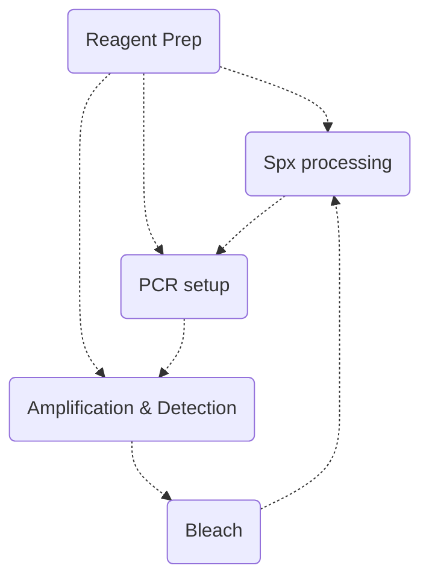

> [!scroller] Table of Contents
> ```table-of-contents
> ```

# MOLECULAR SCIENCE PRINCIPLES

> [!NOTE]
> - Ntrogenous Bases
> 	- Purines (double ring structure)
> 		- Adenine, Guanine
> 	- Pyrimidines (single ring structure)
> 		- Uracil, Thymine, Cytosine
> - NucleoSIDES (Base + Sugar (Pentose))
> 	- RNA (Ribose)
> 	- DNA (Deoxyribose)
> - NucleoTIDES (Base + Sugar + Phosphate)

> [!NOTE] STRUCTURE
> - Primary (depicts nucleotides sequence connected by phosphodiester bonds)
> 	- 5' triphosphate — 3' hydroxyl group
> - Secondary (formation of hydrogen bonding between complementary bases)
> 	- A —(2 hydrogen bonds)— T
> 	- C —(3 hydrogen bonds)— G
> - Tertiary (stacking/folding interactions between 2 polynucleotide strands)
> 	- result to the formation of a double helix structure
> 	- 3 conformations
> 		- B-DNA (common form; wide major grooves accessible to proteins)
> 		- A-DNA (form occuring under dehydrating conditions)
> 		- Z-DNA (form under high salt concentrations)
> - Quaternary (interaction of the strands with other molecules: proteins (histones) nucleosomes) #mcl/list-grid 

> [!NOTE] DNA vs RNA
> - RNA
> 	- less stable due to structural differences; 
> 	- 2° structure is a result of localized pairing when the strand folds on itself; 
> 	- uracil instead of thymine

> [!NOTE] Central Dogma
> - DNA Replication (in nucleus; sp. happens during the S phase of the cell cycle; DNA → DNA)
> 	- Along the cell cycle, checkpoints are present before proceeding to the next cycle (if a particular cell is defective, eliminated through apoptosis; if somehow passes through the checkpoint but defective, results to differnet proteins (cancer))
> - Transcription (in cytoplasm: ribosome; DNA —coded into→ mRNA)
> - Translation (mRNA —used to make→ proteins)
> - Reverse Transcription (RNA → DNA; HIV)

## Enzymes and Nucleic Acid Chemistry

|                                                                                                                                                                                                                                                                                                                                                                                                                                             |                                                              |
| ------------------------------------------------------------------------------------------------------------------------------------------------------------------------------------------------------------------------------------------------------------------------------------------------------------------------------------------------------------------------------------------------------------------------------------------- | ------------------------------------------------------------ |
| Catalyze DNA replication in the <mark class="red">5' to 3' </mark>direction<br><br>Heat stable; Taq Polymerase (derived from: Thermus aquaticus)                                                                                                                                                                                                                                                                                            | <mark class="red">DNA Polymerase</mark>                      |
| Copy a template strand of <mark class="red">DNA into RNA</mark><br><br>POL I & III (synthesize NONcoding RNA)<br>POL II (synthesize mRNA)                                                                                                                                                                                                                                                                                                   | <mark class="red">DNA</mark>-dependent RNA polymerase        |
| Copy a template strand of <mark class="red">RNA into RNA</mark>                                                                                                                                                                                                                                                                                                                                                                             | <mark class="red">RNA</mark>-dependent RNA polymerase        |
| Catalyzes formation of <mark class="red">phosphodiester bonds</mark> between nucleotides                                                                                                                                                                                                                                                                                                                                                    | <mark class="red">DNA Ligase</mark>                          |
| <mark class="red">Cleave the sugar-phosphate bonds</mark> within a strand of DNA, **generating either BLUNT ENDS or a 5’ and 3’ OVERHANG**                                                                                                                                                                                                                                                                                                  | <mark class="red">ENDOnuclease</mark>                        |
| <mark class="red">Removes nucleotides</mark> from ends of single stranded DNA (results to formation of blunt ends: used for molecular cloning processes)                                                                                                                                                                                                                                                                                    | <mark class="red">EXOnuclease</mark>                         |
| - <mark class="red">RNA-dependent DNA polymerase</mark><br>- Uses a <mark class="red">hairpin formation</mark> on the end of the newly synthesized DNA strand **to prime synthesis of the complementary DNA strand.**<br><br>![[Pasted image 20240516202403.png]]                                                                                                                                                                           | <mark class="red">Reverse Transcriptase</mark>               |
| - <mark class="red">Short sequences of DNA</mark> that will **hybridize to a target** and **direct polymerases to the target sequence** to be copied by the polymerase. <br>- PRIMER PAIRS should have **SIMILAR melting temperatures**  <br><br>- Tm too HIGH: <mark class="red">mishybridization</mark> (results to: **F POSitive rx**)  <br>- Tm too LOW: <mark class="red">lack of hybridization</mark> (results to: **F NEGative rx**) | <mark class="red">Primers</mark> (made up of: 15 - 30 bases) |
| A segment of nucleic acid (DNA probes), **complementary to the target sequence**, with a covalently attached <mark class="red">reporter molecule</mark>                                                                                                                                                                                                                                                                                     | <mark class="red">Probes</mark>                              |


## Molecular Processes

|                                                                                                                                                                                                                                                                                                                                                                                                                                                                                                                                                                                                                                                                                                                                        |                                                         |
| -------------------------------------------------------------------------------------------------------------------------------------------------------------------------------------------------------------------------------------------------------------------------------------------------------------------------------------------------------------------------------------------------------------------------------------------------------------------------------------------------------------------------------------------------------------------------------------------------------------------------------------------------------------------------------------------------------------------------------------- | ------------------------------------------------------- |
| - Any nucleic acid can be detected by **hybridizing a <mark class="red">probe</mark>** (labeled with a **FLUORESCENT DYE** or a **RADIOACTIVE ISOTOPE**)<br>- Hybridization temperature <mark class="red">~5C BELOW the Tm</mark><br>- Complex sequences may take longer to reanneal<br><br>- To accelerate hybridization of long probes (<mark class="red">Dextran sulfate, Polyacrylic acid, PEG</mark>)                                                                                                                                                                                                                                                                                                                             | <mark class="red">Hybridization of Nucleic Acids</mark> |
| - The temperature at which **half of a particular DNA duplex will dissociate**<br>- Melting point calculation for **SHORT sequences**<br> <mark class="red">Tm = (4C x # of GC pairs) + (2C x # of AT pairs)</mark> <br>- For longer sequences, calculation of Tm considers <mark class="red">salt concentration</mark>, <mark class="red">G-C content</mark> and <mark class="red">base-pair length</mark>                                                                                                                                                                                                                                                                                                                            | <mark class="red">Melting Temperature</mark>            |
| - Conditions that dictate <mark class="red">how accurately and tightly a probe binds</mark> to its target sequence<br>- <mark class="red">Low stringency</mark> conditions allow for **probe binding in the presence of target sequence MISMATCH**<br>- If stringency is <mark class="red">too high</mark>, a **probe will NOT BIND to its target sequence**<br><br>Controlled by several factors:<br>  - <mark class="red">Temperature</mark> of hybridization (**↓T = ↓ stringency**)<br>  - <mark class="red">Salt concentration</mark> (**↑ salt concentration = ↓ stringency**)<br>  - <mark class="red">Concentration of denaturant</mark><br>  - <mark class="red">Probe length</mark> and <mark class="red">G-C content</mark> | <mark class="red">Stringency</mark>                     |

# MOLECULAR TECHNIQUES

## ISOLATION OF NUCLEIC ACID

> [!NOTE]
> Extraction methods (isolate nucleic acid from other cell components while rendering the sample noninfectious)

| Remarks                                                                                                                                                                                                                                                                                                                                                                                                                                                                                                                                                                                                                                                                                                   | Method                                                           |
| --------------------------------------------------------------------------------------------------------------------------------------------------------------------------------------------------------------------------------------------------------------------------------------------------------------------------------------------------------------------------------------------------------------------------------------------------------------------------------------------------------------------------------------------------------------------------------------------------------------------------------------------------------------------------------------------------------- | ---------------------------------------------------------------- |
| - <mark class="red">Nucleic acid will adsorb to silica</mark> at a certain pH and salt concentration. <br>- Sample is applied to column, washed with buffer, and DNA is eluted with water (only appropriate for FRAGMENTED DNA)                                                                                                                                                                                                                                                                                                                                                                                                                                                                           | <mark class="red">Silica/solid-phase isolation</mark> method     |
| - Cells are **lysed with detergent**. <br>- **DNA is precipitated with <mark class="red">ALCOHOL</mark>**, washed, and **dissolved in the appropriate solution** <br><br>↓ pH & ↑ salt conc.: <mark class="red">precipitation of proteins</mark>; <br>appropriate for isolating LARGE amounts of HMW DNA: <mark class="red">Southern Blot</mark>                                                                                                                                                                                                                                                                                                                                                          | <mark class="red">Salting out</mark> method                      |
| - Use high salt, low pH and organic reagents.<br>-  **DNA will be in the ==AQUEOUS phase==**, **proteins in the ==INTERPHASE==** and **RNA in the ==ORGANIC== phase**. <br>![[Pasted image 20240516211334.png]]<br><br>- Modification with <mark class="red">Guanidium thiocyanate</mark> for recovery of **large quantities of RNA**. **RNA will be in the ==AQUEOUS phase==**, **DNA in the ==INTERPHASE==**, **proteins and lipids in the ==ORGANIC phase==**<br>![[Pasted image 20240516211422.png]]<br><br>Guanidium thiocyanate (denature protein, could separate ribosomal RNA from ribosomes)<br>Can recover **LARGE quantities of nucleic acid**; suitable also for **FRAGMENTED nucleic acids** | <mark class="red">Organic </mark>method (**phenol/ chloroform**) |

## ASSESSING NUCLEIC ACID QUANTITY AND QUALITY

| Remarks                                                                                                                                                                                                                                                                                                                                                                                                                                                                                                                                                                                                                                                                                                                           | Method                                                 |
| --------------------------------------------------------------------------------------------------------------------------------------------------------------------------------------------------------------------------------------------------------------------------------------------------------------------------------------------------------------------------------------------------------------------------------------------------------------------------------------------------------------------------------------------------------------------------------------------------------------------------------------------------------------------------------------------------------------------------------- | ------------------------------------------------------ |
| - Quantification is based on the principle that, because of <mark class="red">adenine residues</mark>, **nucleic acids adsorb light at <mark class="red">260nm</mark>**. <br><mark class="red">Concentration (ug/mL) = (OD260 x df x absorptivity constant)</mark><br>Absorptivity const.: **DNA (50ug/mL)**, **RNA (40ug/mL)**<br><br> - **Protein adsorbs light at <mark class="red">280 nm</mark>** (influenced by AA **Tryptophan**). Assessment of **purity** is achieved by examining the <mark class="red">260/280 ratio</mark>.<br>-- good quality DNA (1.6 to 2.0)<br>-- good quality RNA (2.0 to 2.3)<br><br>Other wavelengths can be used for contamination (peak absorbance): **Phenol (270nm), Thiocyanate (230nm)** | <mark class="red">Spectrophotometry</mark>             |
| - Measures nucleic acid concentration in association with <mark class="red">specific dyes</mark> to intact dsDNA or ssDNA or RNA <br> - <mark class="red">Hoechst 33258</mark>: **most common fluorescent dye** used for **DNA concentration measurement**                                                                                                                                                                                                                                                                                                                                                                                                                                                                        | <mark class="red">Fluorometry</mark>                   |
| - **High-molecular-weight DNA or RNA will produce <mark class="red">strong bands with low mobility</mark>** <br> - <mark class="red">Smearing of bands</mark> is generally indicative of **nucleic acid degradation** and may indicate that the quality is **UNACCEPTABLE for downstream molecular applications**.                                                                                                                                                                                                                                                                                                                                                                                                                | <mark class="red">Electrophoresis</mark> (agarose gel) |

## APPROPRIATE SAMPLES FOR MOLECULAR TESTING

- Preservatives and fixatives are used to **maintain biological samples during collection, transport, and storage**. 
	- Common FIXATIVES: <mark class="red">Aldehydes, Oxidizing agents, protein denaturants, cross-linking agents</mark>
	- Common PRESERVATIVES: <mark class="red">Acid citrate dextrose, EDTA, heparin</mark>
 - ? Certain reagents are INcompatible with some or all molecular procedures 
	- Fixation with <mark class="red">formalin</mark> will result in **fragmented DNA** 
	- <mark class="red">Heavy metals</mark> and <mark class="red">heparin</mark> may produce **false negative or underquantified PCR results** 
 - <mark class="red">Solid tissues</mark> are best analyzed from **fresh or frozen samples**, if precise morphology is not required to identify suitable sampling

### SAMPLE BARRIERS OR INHIBITORS TO MOLECULAR TESTING

|                           |                                                                                                                                                                            |
| ------------------------- | -------------------------------------------------------------------------------------------------------------------------------------------------------------------------- |
| Native to sample <br><br> | - <mark class="red">Hemoglobin</mark> <br> - <mark class="red">Urea</mark> <br> - <mark class="red">Melanin</mark> <br> - <mark class="red">Complex polysaccharides</mark> |
| Processing related <br>   | - <mark class="red">Heparin</mark> <br> - <mark class="red">Heavy metals </mark><br> - <mark class="red">SDS</mark> <br> - <mark class="red">Alcohol</mark>                |

> [!NOTE]
> Magnesium (cofactor of polymerase)
> Most important step in PCR: <mark class="red">Annealing</mark> (where hybridization occurs)

# DNA Amplification by PCR

> [!NOTE] Title
> ![[Pasted image 20240507195216.png]]

- Uses <mark class="red">thermostable polymerase</mark> with **repeating cycles of DNA synthesis** to amplify target sequence. 
 - $ General steps 
	 - <mark class="red">Denaturation</mark>: the reaction mixture is **heated** to separate the two strands of target DNA 
	 - <mark class="red">Annealing</mark>: the mixture is allowed to **cool** so that the primer will anneal to the target DNA in a **sequence-specific manner** 
	 - <mark class="red">Extension/Elongation</mark>: initiated by DNA polymerase, extension **starts in the 3' end**. 
- ~ At the end of each cycle, the PCR products are theoretically **doubled**.

> [!NOTE]
> DNA = 2 <sup>n = number of cycles</sup> 
> 10-fold amplification for every 3.3 cycles (2 <sup>3.3</sup> = 10)
> 10th cycle = 1000 copies
> end of PCR = 10<sup>12</sup> copies of DNA amplications

## PCR MODIFICATIONS

|                                                                                                                                                                                                                                                                                                                                                                                                                                                                                                                                                                                              |                                                                   |
| -------------------------------------------------------------------------------------------------------------------------------------------------------------------------------------------------------------------------------------------------------------------------------------------------------------------------------------------------------------------------------------------------------------------------------------------------------------------------------------------------------------------------------------------------------------------------------------------- | ----------------------------------------------------------------- |
| - Uses <mark class="red">fluorescent dyes or probes</mark> to detect the formation of PCR amplicons during PCR <br> - Requires target specific primers and probe(s) <br> - Commonly used to detect **infectious disease targets** <br> - Allows QUANTITATION of targets, often used to assess efficacy of <mark class="red">antiviral therapy </mark> and to monitor for the development of <mark class="red">drug resistance</mark> <br> - Data are represented on amplification plots **comparing the cycle number to the fluorescence signal**<br><br>probe eg: TaqMan dual labeled probe | <mark class="red">Real-time</mark> PCR (QPCR, qPCR)               |
| - Used to detect <mark class="red">specific RNA sequences </mark><br> - **Template RNA is converted to <mark class="red">cDNA</mark>** in the first step and then PCR proceeds using the cDNA as the template                                                                                                                                                                                                                                                                                                                                                                                | <mark class="red">Reverse transcriptase</mark> PCR (RTPCR, rtPCR) |
| - Uses <mark class="red">more than 1 set of primers</mark> so **multiple targets can be amplified in same tube**, thus identifying multiple targets within the same sample<br><br>several usual of PCR occurring simultanously                                                                                                                                                                                                                                                                                                                                                               | <mark class="red">Multiplex</mark> PCR                            |

## Signal Amplification

- Techniques that <mark class="red">amplify signal</mark> rather than the target sequence
- **Less susceptible to contamination**, but **NOT AS SENSITIVE as target amplification**

## Restriction Fragment Length Polymorphism Analysis

- Use of <mark class="red">restriction endonucleases</mark> to produce **sequence-specific maps of DNA**
- Restriction enzymes must be used at defined conditions to **ensure HIGH SPECIFICITY of recognition and cutting**
- Pattern of fragments produced can be used to **determine identity between 2 individuals** or to identify differences.

## Blotting

- Southern Blot (DNA): for diagnosis of Fragile X Syndrome
- Northern Blot (RNA)
- Western Blot (Proteins): standard confirmatory test for HIV & Lyme dss (2-tiered approach); aka Protein Immunoblot

# CONTAMINATION CONSIDERATIONS

## Avoiding Nucleic Acid Contamination

|                                                                             |                                                                                                                                                                                                                                                                                                                                |
| --------------------------------------------------------------------------- | ------------------------------------------------------------------------------------------------------------------------------------------------------------------------------------------------------------------------------------------------------------------------------------------------------------------------------ |
| <mark class="red">COMINGLING</mark> Specimens                               | - **Leaky containers** can cross-contaminate surfaces, gloves, etc.<br>- <mark class="red">Segregate samples</mark> known to contain **high vs low titer** of pathogens<br>- **Slides may be contaminated with other tissues "floaters"** during the preparation process<br><br>HIGH-titer (Respiratory spx)<br>LOW-tier (CSF) |
| <mark class="red">AEROSOLS</mark>                                           | - **Aerosols or splashes** from positive specimens or positive control<br>- Use <mark class="red">proper pipettes and pipetting technique</mark><br>- Ensure **proper seal** for centrifuge tubes<br>- **Change gloves frequently**, especially between potentially high-titer samples                                         |
| <mark class="red">REAGENT Contamination</mark>                              | - **Aliquot reagents into DAILY or WEEKLY** aliquots when feasible<br>- Perform <mark class="red">extraction and amplification BLANKS</mark> to detect the presence of contamination                                                                                                                                           |
| <mark class="red">GOOD LABORATORY PRACTICES</mark>                          | - The work environment should be **routinely decontaminated** with reagents capable of degrading DNA and PCR products<br>- Practice **UNIdirectional workflow** in combination with physical containment                                                                                                                       |
| <mark class="red">Topical Inactivation</mark> of Nucleic Acid Contamination | - <mark class="red">Sodium hypochlorite</mark> solution<br>- <mark class="red">Ultraviolet</mark> lights (effective for small amts of nucleic acidL <100pg; must be w/in 2 feet of the work surface)                                                                                                                           |
| <mark class="red">Dedicated Equipment and Specialized Consumables</mark>    | - Use <mark class="red">separate pipets</mark> for reagents, samples and PCR products<br>- Use <mark class="red">aerosol-resistant pipet tips</mark>                                                                                                                                                                           |


# GENETIC ANOMALIES

## Polymorphism
- A **genetic change that is NOT DELETERIOUS** and is present in <mark class="red">at least 1%</mark> of the population
- May consist of a **single or multiple alternative nucleotide at a locus**

> [!NOTE]
> naturally happens; results to different blood group systems; different IHC antigens; common to all

## Mutation
- A genetic change with a **DELETERIOUS outcome**, may result in **loss or gain of function**

### CLASSIFICATION OF MUTATIONS

|                                                                                                                                                                                                                                                                                                                                                                                                                                                                                                                                                                                                                                                                                                                                          |                                          |
| ---------------------------------------------------------------------------------------------------------------------------------------------------------------------------------------------------------------------------------------------------------------------------------------------------------------------------------------------------------------------------------------------------------------------------------------------------------------------------------------------------------------------------------------------------------------------------------------------------------------------------------------------------------------------------------------------------------------------------------------- | ---------------------------------------- |
| Addition of <mark class="red">at least 1 nucleotide base pair</mark> in the DNA sequence                                                                                                                                                                                                                                                                                                                                                                                                                                                                                                                                                                                                                                                 | <mark class="red">Insertion</mark>       |
| Deletion of <mark class="red">at least 1 nucleotide base pair</mark> in the DNA sequence                                                                                                                                                                                                                                                                                                                                                                                                                                                                                                                                                                                                                                                 | <mark class="red">Deletion</mark>        |
| Duplication of a portion of DNA resulting in <mark class="red">multiple copies of that region</mark> in the genome                                                                                                                                                                                                                                                                                                                                                                                                                                                                                                                                                                                                                       | <mark class="red">Duplication</mark>     |
| <mark class="red">Reversal of the segment</mark> of a gene or chromosome                                                                                                                                                                                                                                                                                                                                                                                                                                                                                                                                                                                                                                                                 | <mark class="red">Inversions</mark>      |
| <mark class="red">Interchange</mark> of the segment of chromosomes <mark class="red">between NONhomologous chromosomes</mark>                                                                                                                                                                                                                                                                                                                                                                                                                                                                                                                                                                                                            | <mark class="red">Translocations</mark>  |
| A **SINGLE nucleotide change, insertion or deletion**, which leads to: <br> - <mark class="red">NONsense</mark> mutation: result in **premature truncation** of translation <br> - <mark class="red">MISsense</mark> mutation: lead to **changes in protein sequence** <br> - <mark class="red">Silent</mark> mutation: change the **nucleic acid sequence**, but do NOT RESULT in production of either a stop codon or different amino acid <br> - <mark class="red">Splice</mark> mutation: caused by **SLIPPING during DNA replication or chemical changes** <br> - <mark class="red">Frameshit</mark> mutation: lead to **changes in READING FRAME of the ribosome** in translation; **commonly a result of INSERTIONS & DELETIONS** | <mark class="red">Point mutations</mark> |

> [!NOTE]
> CML: t(9,22)
> APL: t(15,17)
